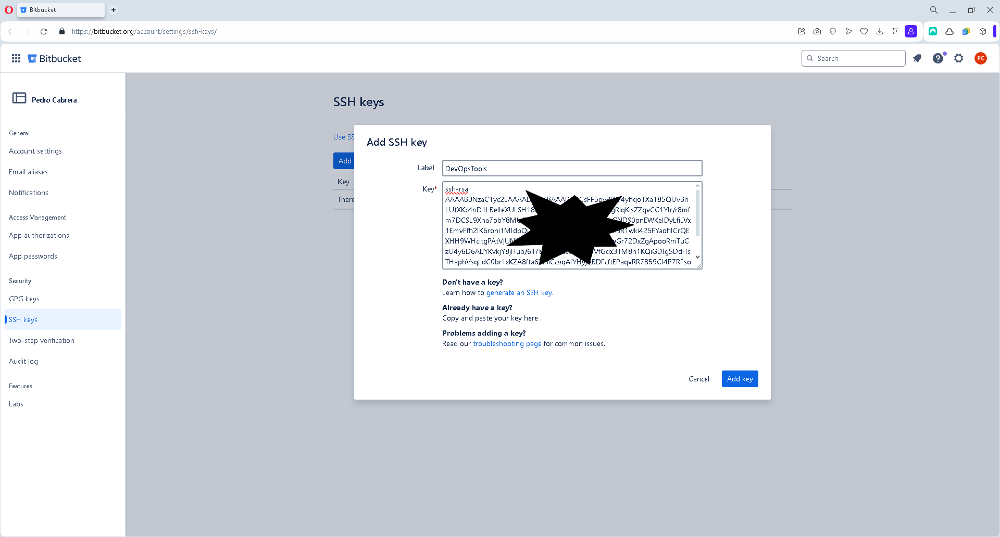
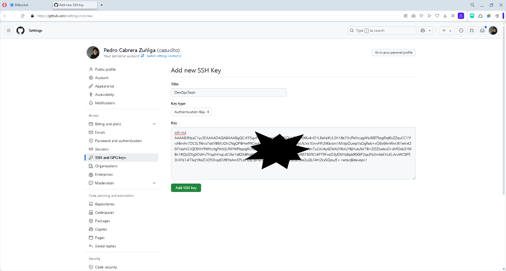
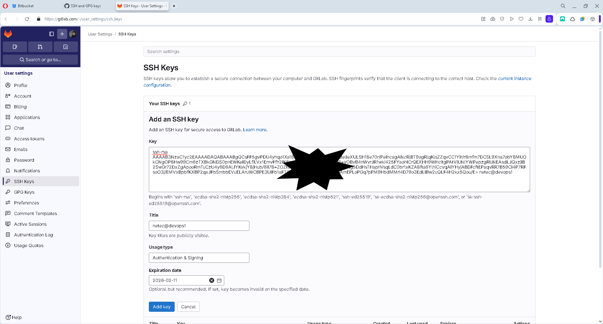
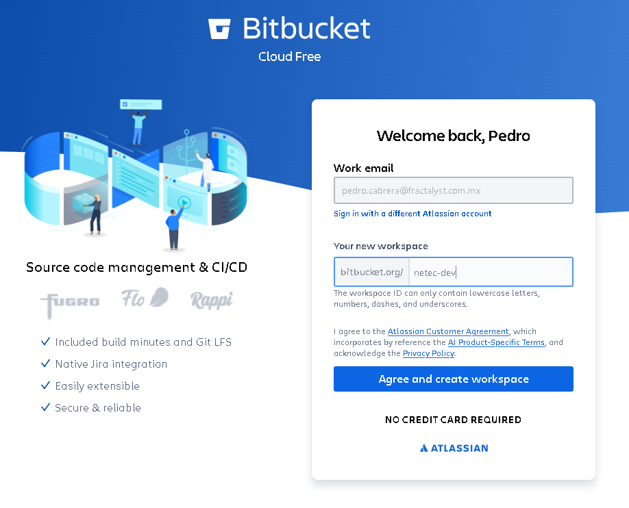
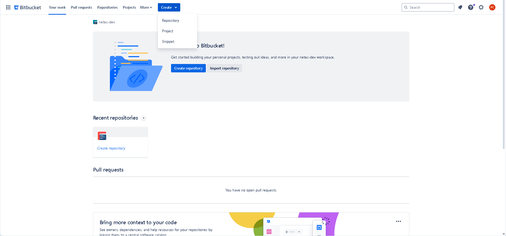
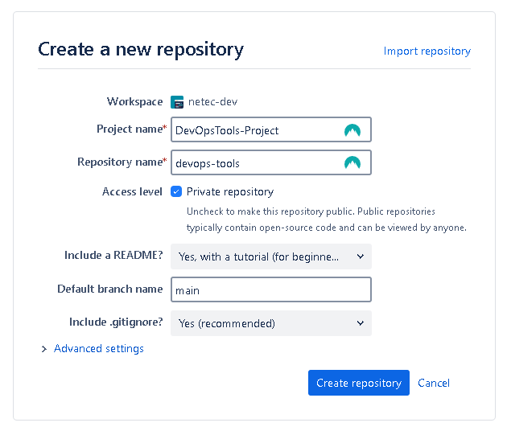
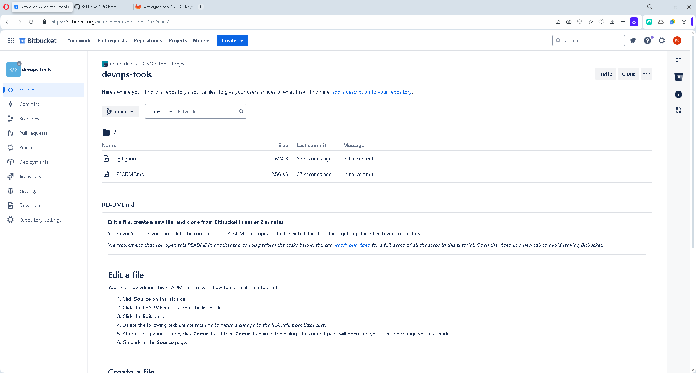
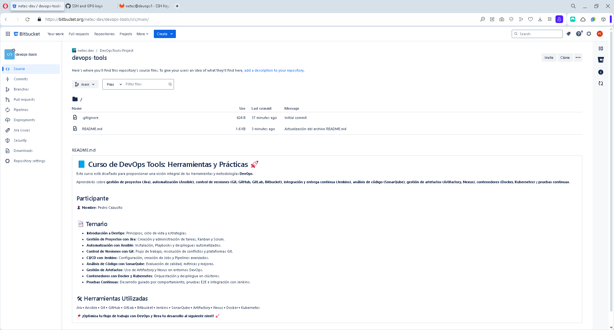
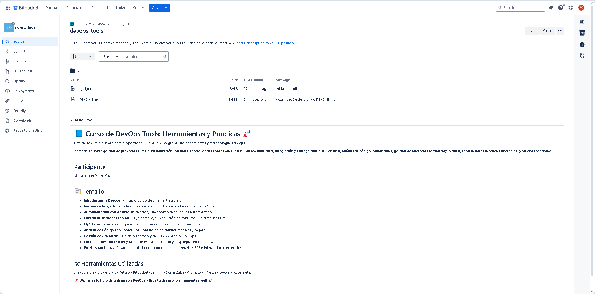

# Práctica 4.3. Servidor Git

### Objetivos de la práctica:

Al termino de este capítulo, serás capaz de:

- Interactuar con plataformas de servidores de repositorios Git.

### Duración aproximada:
- 40 minutos.

### Prerrequisitos

Para esta actividad se requiere:

- Acceso a Internet.
- Acceso mediante SSH a un servidor Linux.
- Conocimientos básicos de la terminal de Linux.
- Actividad anterior completada.

### Instrucciones

En esta actividad te familiarizaras con una plataforma de control de versiones y colaboración de código. :leveloffset: +1

### Prerrequisitos

Para esta actividad necesitarás crear una cuenta en Bitbucket, GitHub y GitLab. Además, necesitarás configurar el mecanismo de autenticación de llaves SSH en tu computadora.

#### Cuentas de acceso

##### Bitbucket

[Bitbucket](<https://bitbucket.org/>) es una plataforma de gestión de código fuente basada en **Git** desarrollada por Atlassian.

Permite a equipos de desarrollo gestionar repositorios, realizar integraciones continuas y colaborar en proyectos de software.

###### Pasos para crear una cuenta en Bitbucket

- Acceder al sitio web de Bitbucket.
  - Abrir tu navegador web y dirigirse a la página oficial de Bitbucket: **[<https://bitbucket.org/>](<https://bitbucket.org/>)**.
- Iniciar el proceso de registro.
  - En la página principal, hacer clic en el botón **"Get started"** o **"Sign up"**.
- Ingresar la información requerida.

Bitbucket permite registrarse utilizando:

- Una **dirección de correo electrónico**.
- Una **cuenta de Google**.
- Una **cuenta de Atlassian** (si ya tienes una).

Si decides registrarte con tu correo electrónico, deberás proporcionar:

- **Nombre completo**.
- **Dirección de correo electrónico válida**.
- **Nombre de usuario**.
- **Contraseña segura**.

- Confirmar el correo electrónico.
  - Bitbucket enviará un correo de verificación a la dirección ingresada.
  - Abrir tu bandeja de entrada y hacer clic en el enlace de verificación.
  - Si no recibes el correo, revisa tu carpeta de spam o intenta reenviar la verificación desde Bitbucket.

¡Listo!, Ya tienes tu cuenta y puedes empezar a gestionar tu código en Bitbucket.

##### GitHub

[GitHub](<https://github.com/>) es una plataforma de alojamiento de código fuente basada en **Git**, que permite a desarrolladores y equipos colaborar en proyectos de software, realizar control de versiones y automatizar flujos de trabajo mediante GitHub Actions.

###### Pasos para crear una cuenta en GitHub

- Acceder al sitio web de GitHub.
  - Abrir tu navegador y dirigirse a la página oficial de GitHub: **[<https://github.com/>](<https://github.com/>)**.
- Iniciar el proceso de registro.
  - En la página principal, hacer clic en el botón **"Sign up"**.
- Ingresar la información requerida.
  - GitHub solicita los siguientes datos:
    - **Nombre de usuario** (único en la plataforma).
    - **Dirección de correo electrónico válida**.
    - **Contraseña segura**.

Después de completar estos datos, hacer clic en **"Create account"**.

- Verificación de seguridad.
  - GitHub puede solicitar una verificación **Captcha** para confirmar que no eres un bot.
  - Es posible que te envíen un código de confirmación al correo registrado.
- Confirmar el correo electrónico.
  - Revisar tu bandeja de entrada y abrir el correo enviado por GitHub.
  - Hacer clic en el enlace de verificación para activar tu cuenta.

¡Listo! Ahora tienes tu cuenta en GitHub y puedes empezar a gestionar tu código.

##### GitLab

[GitLab](<https://gitlab.com/>) es una plataforma de gestión de código fuente basada en **Git**, que ofrece un conjunto completo de herramientas para **integración y entrega continua (CI/CD)**, gestión de proyectos y automatización del desarrollo de software.

###### Pasos para crear una cuenta en GitLab

- Acceder al sitio web de GitLab.
  - Abrir tu navegador y dirigirse a la página oficial de GitLab: **[<https://gitlab.com/>](<https://gitlab.com/>)**
- Iniciar el proceso de registro.
  - En la página principal, hacer clic en el botón **"Sign up / Register"**.
- Ingresar la información requerida.
  - GitLab permite registrarse mediante:
    - Una **dirección de correo electrónico**.
      - Si eliges registrarte con tu correo electrónico, deberás proporcionar:
        - **Nombre de usuario**.
        - **Dirección de correo electrónico válida**.
        - **Contraseña segura**. 
    - Una **cuenta de Google** o **GitHub**.

Después de completar los datos, aceptar los **Términos y Condiciones** y hacer clic en **"Register"**.

- Confirmar el correo electrónico
  - GitLab enviará un correo de verificación a la dirección ingresada.
  - Abrir tu bandeja de entrada y hacer clic en el enlace de verificación.
  - Si no encuentras el correo, revisar tu carpeta de spam o solicita un reenvío.

¡Listo!, Ahora tienes tu cuenta en GitLab y puedes empezar a gestionar tu código.

##### Consejos de seguridad

Para mantener segura tu cuenta y repositorios, sigue estas recomendaciones:

- Habilitar la **autenticación en dos pasos (2FA)** en la configuración de seguridad.
- Usar **claves SSH** para una autenticación más segura en tus repositorios.
- Mantener tu repositorio **privado** si contiene información sensible.

#### Configuración de llaver SSH

Para autenticarse en los servicios de Bitbucket, GitHub y GitLab, necesitarás configurar un par de llaves SSH en tu computadora.

##### Validar la existencia de llaves SSH

Para verificar si ya tienes un par de llaves SSH en tu computadora, ejecutar el siguiente comando en la terminal del equipo de trabajo principal:

``` shell
ls -al ~/.ssh
```

Si obtienes una salida similar a la siguiente, significa que ya tienes un par de llaves SSH:

``` shell
total 20
drwx------ 2 netec netec 4096 Feb 10 16:46 .
drwxr-xr-x 6 netec netec 4096 Feb 11 11:34 ..
-rw------- 1 netec netec 2602 Feb 10 16:38 id_rsa
-rw-r--r-- 1 netec netec  567 Feb 10 16:38 id_rsa.pub
-rw-r--r-- 1 netec netec  444 Feb 10 16:46 known_hosts
```

###### Generar un par de llaves SSH

**Unicamente si no tienes un par de llaves SSH**, generar un nuevo par de llaves SSH en tu computadora de trabajo principal.

Para ello, ejecutar el siguiente comando:

``` shell
#ssh-keygen -t rsa -C "pedro.cazucito@netec.com"
#ssh-keygen -t ed25519 -C "pedro.cazucito@netec.com"
ssh-keygen
```

Donde:

- `-t ed25519`: Especificar el tipo de algoritmo de cifrado a utilizar.
- `-C "TU CORREO"`: Especificar una etiqueta para identificar la llave.

Contesta presionando la tecla `Enter` a las siguientes tres solicitudes de información.

A continuación, se muestra una ejecución del comando:

``` shell
Generating public/private ed25519 key pair.
Enter file in which to save the key (/home/usuario/.ssh/id_ed25519):
Enter passphrase (empty for no passphrase):
Enter same passphrase again:
Your identification has been saved in /home/usuario/.ssh/id_ed25519
Your public key has been saved in /home/usuario/.ssh/id_ed25519.pub
The key fingerprint is:
SHA256:NshhPwB/DBBp5rXobgETD76ba6Agiz2n7gAQ7x8d8Fg pedro.cabrera@fractalyst.com.mx
The keys randomart image is:
+--[ED25519 256]--
|.  =+E          |
| oo +B.o         |
|...B.oB.o        |
|..+ ++.B         |
|. .=. + S        |
|= ..o. . o       |
|*+ +..          |
|+.* +            |
| +=*             |
+----[SHA256]-----+
```

##### Adicionar llave SSH

Una vez generadas las llaves SSH, es necesario agregar la llave pública a tu cuenta de Bitbucket, GitHub y GitLab.

Recuerda que la llave pública tiene la extensión `.pub` y se encuentra en la ruta `~/.ssh/id_rsa.pub`. Para visualizar el contenido de la llave pública, ejecuta el siguiente comando:

``` shell
cat ~/.ssh/id_rsa.pub
```

La salida del comando mostrará la llave pública que debes agregar a tu cuenta en las plataformas de control de versiones.

``` shell
ssh-rsa AAAAB3NzaC1yc2EAAAADAQABAAABgQCsFF5gvPDU4yhqo1Xa185QUvBnLUtXKc4nD1LBelIeXULSH18e70r/PeIhcagANcRlBT9ogRlqKlsZZqvCC1YIr/+/6iI78+ZOZtadxsG+dVfGdx31M8n1KQiGDIg5DdHsTHaphVsqLdC0br1xKZA8fta6YlhiCcvqAIYHyjABDFcftEPaqvRR7B59CI4P7RFsoO3j/EMVxBpbfKXBP2qxJFbSmbbEVuELAruWCBPE3UIFb1aFT6qYXoZUO92kqdDJf8YoAmEPLoPGq7pPM9HbdMMri4D79o3EdLIBw2uQLF4H2kx5Qou/E= netec@devops1
```

<div class="note">

El texto mostrado es un ejemplo. Tu llave pública será diferente. Puede variar en longitud y contenido. Es importante mencionar que el contenido de la llave esta en una sola línea.

</div>

###### Bitbucket

Para agregar tu llave SSH a Bitbucket, sigue estos pasos:

1. Acceder a tu cuenta de Bitbucket.
2. Hacer clic en tu avatar y seleccionar **"Bitbucket settings"**.
3. En el menú lateral, seleccionar **"SSH keys"**.
4. Hacer clic en **"Add key"**.
5. En la ventana emergente, copiar el contenido de tu llave pública (`~/.ssh/id_rsa.pub`) y pégalo en el campo **"Key"**.
6. Asignar un nombre descriptivo a la llave y hacer clic en **"Add key"**.

- Enlace directo: <https://bitbucket.org/account/settings/ssh-keys/>



**Validar la conexión**

Para validar la conexión SSH con Bitbucket, ejecutar el comando mostrado adelante en la terminal de tu equipo de trabajo principal. Si solicita confirmación, responder con `yes`.

``` shell
ssh -T git@bitbucket.org
```

La salida del comando mostrará un mensaje de confirmación de la conexión exitosa.

``` shell
The authenticity of host 'bitbucket.org (104.192.142.26)' can't be established.
ECDSA key fingerprint is SHA256:FC73VB6C4OQLSCrjEayhMp9UMxS97caD/Yyi2bhW/J0.
Are you sure you want to continue connecting (yes/no/[fingerprint])? yes
Warning: Permanently added 'bitbucket.org,104.192.142.26' (ECDSA) to the list of known hosts.
authenticated via ssh key.

You can use git to connect to Bitbucket. Shell access is disabled
```

###### GitHub

Para agregar tu llave SSH a GitHub, sigue estos pasos:

1. Acceder a tu cuenta de GitHub.
2. Hacer clic en tu avatar y seleccionar **"Settings"**.
3. En el menú lateral, seleccionar **"SSH and GPG keys"**.
4. Hacer clic en **"New SSH key"**.
5. En el campo **"Title"**, asignar un nombre descriptivo a la llave.
6. En el campo **"Key"**, copiar el contenido de tu llave pública (`~/.ssh/id_rsa.pub`).
7. Hacer clic en **"Add SSH key"**.

- Enlace directo: <https://github.com/settings/keys>



**Validar la conexión**

Para validar la conexión SSH con GitHub, ejecutar el comando mostrado adelante en la terminal de tu equipo de trabajo principal. Si solicita confirmación, responder con `yes`.

``` shell
ssh -T git@github.com
```

La salida del comando mostrará un mensaje de confirmación de la conexión exitosa.

``` shell
The authenticity of host 'github.com (140.82.114.3)' can't be established.
ECDSA key fingerprint is SHA256:p2QAMXNIC1TJYWeIOttrVc98/R1BUFWu3/LiyKgUfQM.
Are you sure you want to continue connecting (yes/no/[fingerprint])? yes
Warning: Permanently added 'github.com,140.82.114.3' (ECDSA) to the list of known hosts.
Hi cazucito! You've successfully authenticated, but GitHub does not provide shell access.
```

###### GitLab

Para agregar tu llave SSH a GitLab, sigue estos pasos:

1. Acceder a tu cuenta de GitLab.
2. Hacer clic en tu avatar y seleccionar **"Preferences"**.
3. En el menú lateral, seleccionar **"SSH keys"**.
4. En el campo **"Key"**, copiar el contenido de tu llave pública (`~/.ssh/id_rsa.pub`).
5. Asignar un título descriptivo a la llave y hacer clic en **"Add key"**.

- Enlace directo: <https://gitlab.com/-/user_settings/ssh_keys>



**Validar la conexión**

Para validar la conexión SSH con GitHub, ejecutar el comando mostrado adelante en la terminal de tu equipo de trabajo principal. Si solicita confirmación, responder con `yes`.

``` shell
ssh -T git@gitlab.com
```

La salida del comando mostrará un mensaje de confirmación de la conexión exitosa.

``` shell
The authenticity of host 'gitlab.com (172.65.251.78)' can't be established.
ECDSA key fingerprint is SHA256:HbW3g8zUjNSksFbqTiUWPWg2Bq1x8xdGUrliXFzSnUw.
Are you sure you want to continue connecting (yes/no/[fingerprint])? yes
Warning: Permanently added 'gitlab.com,172.65.251.78' (ECDSA) to the list of known hosts.
Welcome to GitLab, @cazucito!
```

### Creación de un repositorio

#### Bitbucket

Ya autenticado en Bitbucket, vamos a crear un nuevo repositorio.

En ocasiones se requiere crear un espacio de trabajo (workspace) en Bitbucket, si no lo has hecho, sigue los pasos en la interfaz de Bitbucket.



##### Creación del Repositorio "DevOpsTools"

1. En la parte superior, hacer clic en el botón **"Create"**.

2. Seleccionar **"Repository"** en el menú desplegable.



Completar el formulario con la siguiente información:

- **Project name**: `DevOpsTools-Project`
- **Repository name**: `devops-tools`
- **Access level**:
  - **Private** (recomendado para proyectos internos o sensibles).
  - **Public** (visible para cualquier usuario).
- **Include a README?**: Marcar esta opción para inicializar el repositorio con un archivo `README.md`.
- **Default branch**: `main`.
- **Include a .gitignore?**: Seleccionar un archivo `.gitignore` basado en el lenguaje del proyecto.



##### Finalizar la creación

- Una vez configurado el repositorio, hacer clic en **"Create repository"**.
- Bitbucket te redirigirá a la página del repositorio recién creado.



#### Clonar el repositorio localmente

Para trabajar con el repositorio en tu máquina, clonarlo usando `git`:

``` sh
git clone git@bitbucket.org:netec-dev/devops-tools.git
```

Recuerda reemplazar `netec-dev` por tu usuario de Bitbucket.

La salida será similar a:

``` sh
Cloning into 'devops-tools'...
Warning: Permanently added the ECDSA host key for IP address '104.192.142.24' to the list of known hosts.
remote: Enumerating objects: 4, done.
remote: Counting objects: 100% (4/4), done.
remote: Compressing objects: 100% (4/4), done.
remote: Total 4 (delta 0), reused 0 (delta 0), pack-reused 0 (from 0).
Receiving objects: 100% (4/4), done.
```

Para evitar cualquier problema con el nombrado de las carpetas, cambiar el nombre del directorio de `devops-tools` a `devops-tools_bitbucket`. (`mv devops-tools/ devops-tools_bitbucket`)

#### Agregar y subir archivos al repositorio

Posicionarse en el directorio del repositorio y realizar alguna modificación en los archivos.

Por ejemplo, cambiar el contenido del archivo `README.md` por el propuesto.

- Sustituye `[Juan Pérez]` por tu nombre.

``` markdown
# 📘 Curso de DevOps Tools: Herramientas y Prácticas 🚀

Este curso está diseñado para proporcionar una visión integral de las herramientas y metodologías **DevOps**. Aprenderás sobre **gestión de proyectos (Jira)**, **automatización (Ansible)**, **control de versiones (Git, GitHub, GitLab, Bitbucket)**, **integración y entrega continua (Jenkins)**, **análisis de código (SonarQube)**, **gestión de artefactos (Artifactory, Nexus)**, **contenedores (Docker, Kubernetes)** y **pruebas continuas**.

## Participante

👤 **Nombre**: [Juan Pérez]

## 📑 Temario
🔹 **Introducción a DevOps**: Principios, ciclo de vida y estrategias.
🔹 **Gestión de proyectos con Jira**: Creación y administración de tareas, Kanban y Scrum.
🔹 **Automatización con Ansible**: Instalación, Playbooks y despliegues automatizados.
🔹 **Control de versiones con Git**: Flujo de trabajo, resolución de conflictos y plataformas Git.
🔹 **CI/CD con Jenkins**: Configuración, creación de Jobs y Pipelines avanzados.
🔹 **Análisis de código con SonarQube**: Evaluación de calidad, métricas y mejoras.
🔹 **Gestión de artefactos**: Uso de Artifactory y Nexus en entornos DevOps.
🔹 **Contenedores con Docker y Kubernetes**: Orquestación y despliegue en clústeres.
🔹 **Pruebas continuas**: Desarrollo guiado por comportamiento, pruebas E2E e integración con Jenkins.

## 🛠 Herramientas utilizadas
Jira • Ansible • Git • GitHub • GitLab • Bitbucket • Jenkins • SonarQube • Artifactory • Nexus • Docker • Kubernetes

📌 **¡Optimiza tu flujo de trabajo con DevOps y lleva tu desarrollo al siguiente nivel! 🚀**
```

Guarda los cambios y sube los archivos al repositorio:

``` sh
git add README.md
git commit -m "Actualización del archivo README.md"
```

La salida será similar a:

``` sh
[main 52566ba] Actualización del archivo README.md
 1 file changed, 23 insertions(+), 45 deletions(-)
 rewrite README.md (99%)
```

Y para subir los cambios:

``` sh
git push origin main
```

``` sh
Enumerating objects: 5, done.
Counting objects: 100% (5/5), done.
Delta compression using up to 4 threads
Compressing objects: 100% (3/3), done.
Writing objects: 100% (3/3), 1.13 KiB | 1.13 MiB/s, done.
Total 3 (delta 0), reused 0 (delta 0)
To bitbucket.org:netec-dev/devops-tools.git
   c538703..52566ba  main -> main
```



#### GitHub y GitLab (OPCIONAL)

Repetir los pasos anteriores para crear un repositorio en GitHub y GitLab.

## Resultado

Al finalizar serás capaz de interactuar con plataformas de servidores de repositorios Git.


