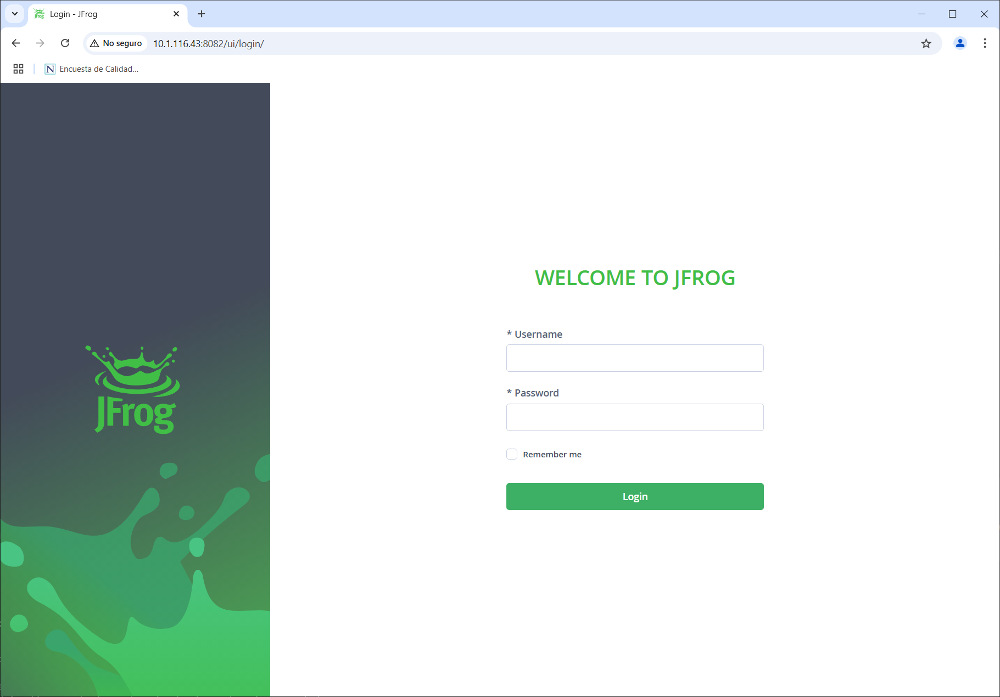
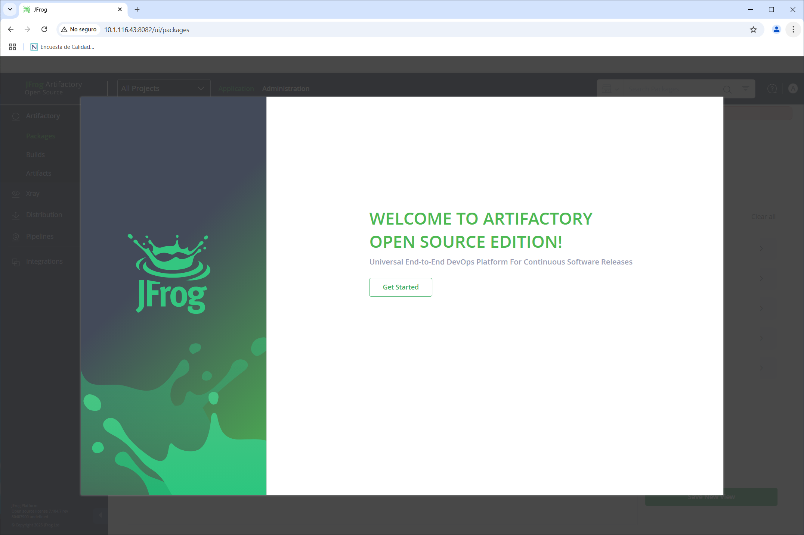
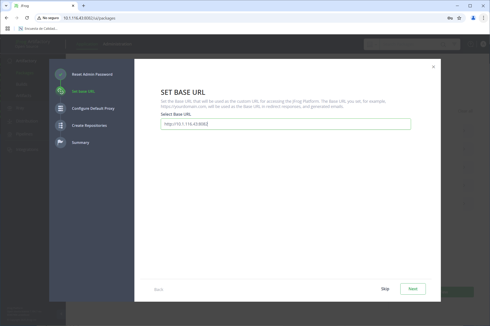
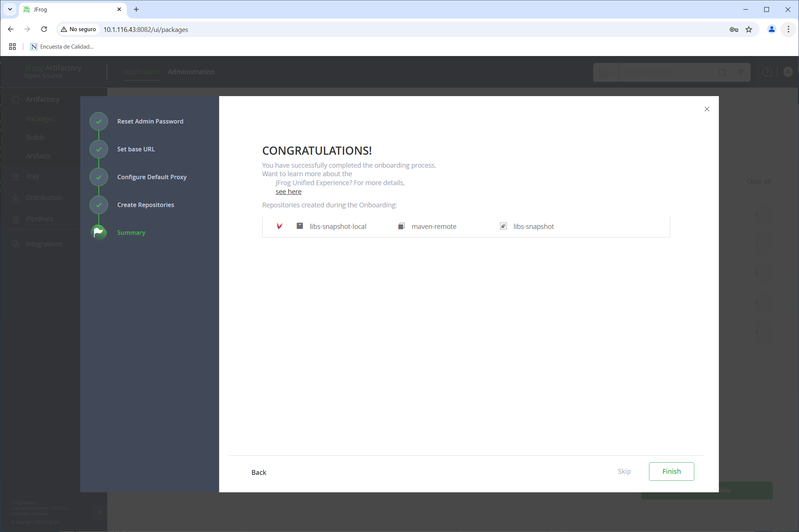
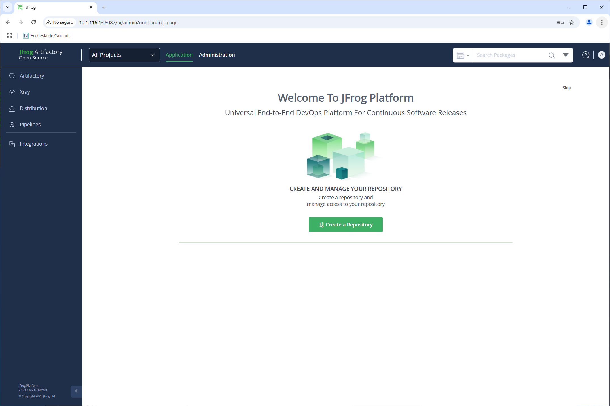

# Práctica 7.1. Artefactos / Instalación de JFrog Artifactory 

## Objetivos de la práctica
Al termino de este capítulo, serás capaz de:

- Instalar JFrog Artifactory en sistemas basados en Linux Ubuntu.

## Duración aproximada
- 30 minutos.

## Prerrequisitos

Para esta actividad se requiere:

- Acceso a Internet.
- Acceso mediante SSH a un servidor Linux.

## Instrucciones

### Requerimientos previos

Si la arquitectura del ambiente de laboratorios lo permite, instalar JFrog Artifactory en un servidor dedicado.

- En está guía se considera el nodo identificado por: `10.11.116.43`.

#### Actualización de paquetes

Antes del proceso de instalación, actualizar los paquetes del sistema:

``` bash
sudo apt update
```

La salida debe ser similar a:

``` text
Hit:1 http://mx.archive.ubuntu.com/ubuntu focal InRelease
Get:2 http://security.ubuntu.com/ubuntu focal-security InRelease [128 kB]
Get:3 http://mx.archive.ubuntu.com/ubuntu focal-updates InRelease [128 kB]
Get:4 http://mx.archive.ubuntu.com/ubuntu focal-backports InRelease [128 kB]
Get:5 http://mx.archive.ubuntu.com/ubuntu focal-updates/main amd64 Packages [3,775 kB]
Fetched 4,158 kB in 3s (1,621 kB/s)
Reading package lists... Done
Building dependency tree
Reading state information... Done
30 packages can be upgraded. Run 'apt list --upgradable' to see them.
```

#### JDK 17

Para instalar el Java Development Kit ejecutar:

``` bash
sudo apt install openjdk-17-jdk -y
```

Verificar la instalación:

``` bash
java -version
```

La salida debe ser similar a:

``` text
openjdk version "17.0.14" 2025-01-21
OpenJDK Runtime Environment (build 17.0.14+7-Ubuntu-120.04)
OpenJDK 64-Bit Server VM (build 17.0.14+7-Ubuntu-120.04, mixed mode, sharing)
```

#### PostgreSQL 17

Para instalar PostgreSQL, primero agregar el repositorio de PostgreSQL. El repositorio de PostgreSQL contiene muchos paquetes, incluidos PostgreSQL, pgAdmin, y otros.

Para la configuración automática de repositorios, ejecutar:

``` bash
sudo apt install -y postgresql-common
```

La salida debe ser similar a:

``` text
Reading package lists... Done
Building dependency tree
Reading state information... Done
The following additional packages will be installed:
  postgresql-client-common ssl-cert
Suggested packages:
  libjson-perl openssl-blacklist
The following NEW packages will be installed:
  postgresql-client-common postgresql-common ssl-cert
0 upgraded, 3 newly installed, 0 to remove and 30 not upgraded.
Need to get 214 kB of archives.
After this operation, 940 kB of additional disk space will be used.
Get:1 http://mx.archive.ubuntu.com/ubuntu focal-updates/main amd64 postgresql-client-common all 214ubuntu0.1 [28.2 kB]
Get:2 http://mx.archive.ubuntu.com/ubuntu focal/main amd64 ssl-cert all 1.0.39 [17.0 kB]
Get:3 http://mx.archive.ubuntu.com/ubuntu focal-updates/main amd64 postgresql-common all 214ubuntu0.1 [169 kB]
Fetched 214 kB in 1s (195 kB/s)
Preconfiguring packages ...
Selecting previously unselected package postgresql-client-common.
(Reading database ... 124185 files and directories currently installed.)
Preparing to unpack .../postgresql-client-common_214ubuntu0.1_all.deb ...
Unpacking postgresql-client-common (214ubuntu0.1) ...
Selecting previously unselected package ssl-cert.
Preparing to unpack .../ssl-cert_1.0.39_all.deb ...
Unpacking ssl-cert (1.0.39) ...
Selecting previously unselected package postgresql-common.
Preparing to unpack .../postgresql-common_214ubuntu0.1_all.deb ...
Adding 'diversion of /usr/bin/pg_config to /usr/bin/pg_config.libpq-dev by postgresql-common'
Unpacking postgresql-common (214ubuntu0.1) ...
Setting up postgresql-client-common (214ubuntu0.1) ...
Setting up ssl-cert (1.0.39) ...
Setting up postgresql-common (214ubuntu0.1) ...
Adding user postgres to group ssl-cert

Creating config file /etc/postgresql-common/createcluster.conf with new version
Building PostgreSQL dictionaries from installed myspell/hunspell packages...
Removing obsolete dictionary files:
Created symlink /etc/systemd/system/multi-user.target.wants/postgresql.service → /lib/systemd/system/postgresql.service.
Processing triggers for man-db (2.9.1-1) ...
Processing triggers for systemd (245.4-4ubuntu3.24) ...
```

Agregar el repositorio de PostgreSQL:

``` bash
sudo /usr/share/postgresql-common/pgdg/apt.postgresql.org.sh
```

La salida debe ser similar a:

``` text
This script will enable the PostgreSQL APT repository on apt.postgresql.org on
your system. The distribution codename used will be focal-pgdg.

Press Enter to continue, or Ctrl-C to abort.
Writing /etc/apt/sources.list.d/pgdg.list ...
Importing repository signing key ...
OK
Running apt-get update ...
Hit:1 http://security.ubuntu.com/ubuntu focal-security InRelease
Get:2 http://apt.postgresql.org/pub/repos/apt focal-pgdg InRelease [129 kB]
Hit:3 http://mx.archive.ubuntu.com/ubuntu focal InRelease
Hit:4 http://mx.archive.ubuntu.com/ubuntu focal-updates InRelease
Hit:5 http://mx.archive.ubuntu.com/ubuntu focal-backports InRelease
Get:6 http://apt.postgresql.org/pub/repos/apt focal-pgdg/main amd64 Packages [351 kB]
Fetched 480 kB in 2s (316 kB/s)
Reading package lists... Done
N: Skipping acquire of configured file 'main/binary-i386/Packages' as repository 'http://apt.postgresql.org/pub/repos/apt focal-pgdg InRelease' doesn't support architecture 'i386'

You can now start installing packages from apt.postgresql.org.

Have a look at https://wiki.postgresql.org/wiki/Apt for more information;
most notably the FAQ at https://wiki.postgresql.org/wiki/Apt/FAQ
```

Update the package lists:

``` bash
sudo apt update
```

La salida debe ser similar a:

``` text
Hit:1 http://mx.archive.ubuntu.com/ubuntu focal InRelease
Hit:2 http://apt.postgresql.org/pub/repos/apt focal-pgdg InRelease
Hit:3 http://security.ubuntu.com/ubuntu focal-security InRelease
Hit:4 http://mx.archive.ubuntu.com/ubuntu focal-updates InRelease
Hit:5 http://mx.archive.ubuntu.com/ubuntu focal-backports InRelease
Reading package lists... Done
Building dependency tree
Reading state information... Done
32 packages can be upgraded. Run 'apt list --upgradable' to see them.
N: Skipping acquire of configured file 'main/binary-i386/Packages' as repository 'http://apt.postgresql.org/pub/repos/apt focal-pgdg InRelease' doesn't support architecture 'i386'
```

Ahora, instalar la versión 17 de PostgreSQL:

``` bash
# Install the latest version of PostgreSQL:
# If you want a specific version, use 'postgresql-16' or similar instead of 'postgresql'
sudo apt -y install postgresql-17
```

La salida debe ser similar a:

``` text
Reading package lists... Done
Building dependency tree
Reading state information... Done
The following additional packages will be installed:
  libcommon-sense-perl libio-pty-perl libipc-run-perl libjson-perl libjson-xs-perl libllvm10 libpq5 libtypes-serialiser-perl postgresql-client-17 postgresql-client-common
  postgresql-common postgresql-common-dev sysstat
Suggested packages:
  postgresql-doc-17 isag
The following NEW packages will be installed:
  libcommon-sense-perl libio-pty-perl libipc-run-perl libjson-perl libjson-xs-perl libllvm10 libpq5 libtypes-serialiser-perl postgresql-17 postgresql-client-17
  postgresql-common-dev sysstat
The following packages will be upgraded:
  postgresql-client-common postgresql-common
2 upgraded, 12 newly installed, 0 to remove and 30 not upgraded.
Need to get 37.0 MB of archives.
After this operation, 150 MB of additional disk space will be used.
Get:1 http://mx.archive.ubuntu.com/ubuntu focal/main amd64 libjson-perl all 4.02000-2 [80.9 kB]
Get:2 http://apt.postgresql.org/pub/repos/apt focal-pgdg/main amd64 postgresql-common all 273.pgdg20.04+1 [182 kB]
Get:3 http://mx.archive.ubuntu.com/ubuntu focal/main amd64 libio-pty-perl amd64 1:1.12-1 [32.4 kB]
Get:4 http://mx.archive.ubuntu.com/ubuntu focal/main amd64 libipc-run-perl all 20180523.0-2 [89.7 kB]
Get:5 http://mx.archive.ubuntu.com/ubuntu focal/main amd64 libcommon-sense-perl amd64 3.74-2build6 [20.1 kB]
Get:6 http://mx.archive.ubuntu.com/ubuntu focal/main amd64 libtypes-serialiser-perl all 1.0-1 [12.1 kB]
Get:7 http://mx.archive.ubuntu.com/ubuntu focal/main amd64 libjson-xs-perl amd64 4.020-1build1 [83.7 kB]
Get:8 http://mx.archive.ubuntu.com/ubuntu focal/main amd64 libllvm10 amd64 1:10.0.0-4ubuntu1 [15.3 MB]
Get:9 http://apt.postgresql.org/pub/repos/apt focal-pgdg/main amd64 postgresql-client-common all 273.pgdg20.04+1 [105 kB]
Get:10 http://apt.postgresql.org/pub/repos/apt focal-pgdg/main amd64 postgresql-common-dev all 273.pgdg20.04+1 [131 kB]
Get:11 http://apt.postgresql.org/pub/repos/apt focal-pgdg/main amd64 libpq5 amd64 17.3-3.pgdg20.04+1 [224 kB]
Get:12 http://apt.postgresql.org/pub/repos/apt focal-pgdg/main amd64 postgresql-client-17 amd64 17.3-3.pgdg20.04+1 [2,028 kB]
Get:13 http://mx.archive.ubuntu.com/ubuntu focal-updates/main amd64 sysstat amd64 12.2.0-2ubuntu0.3 [448 kB]
Get:14 http://apt.postgresql.org/pub/repos/apt focal-pgdg/main amd64 postgresql-17 amd64 17.3-3.pgdg20.04+1 [18.2 MB]
Fetched 37.0 MB in 9s (4,097 kB/s)
Preconfiguring packages ...
Selecting previously unselected package libjson-perl.
(Reading database ... 124339 files and directories currently installed.)
Preparing to unpack .../00-libjson-perl_4.02000-2_all.deb ...
Unpacking libjson-perl (4.02000-2) ...
Preparing to unpack .../01-postgresql-common_273.pgdg20.04+1_all.deb ...
Leaving 'diversion of /usr/bin/pg_config to /usr/bin/pg_config.libpq-dev by postgresql-common'
Unpacking postgresql-common (273.pgdg20.04+1) over (214ubuntu0.1) ...
Preparing to unpack .../02-postgresql-client-common_273.pgdg20.04+1_all.deb ...
Unpacking postgresql-client-common (273.pgdg20.04+1) over (214ubuntu0.1) ...
Selecting previously unselected package libio-pty-perl.
Preparing to unpack .../03-libio-pty-perl_1%3a1.12-1_amd64.deb ...
Unpacking libio-pty-perl (1:1.12-1) ...
Selecting previously unselected package libipc-run-perl.
Preparing to unpack .../04-libipc-run-perl_20180523.0-2_all.deb ...
Unpacking libipc-run-perl (20180523.0-2) ...
Selecting previously unselected package postgresql-common-dev.
Preparing to unpack .../05-postgresql-common-dev_273.pgdg20.04+1_all.deb ...
Unpacking postgresql-common-dev (273.pgdg20.04+1) ...
Selecting previously unselected package libcommon-sense-perl.
Preparing to unpack .../06-libcommon-sense-perl_3.74-2build6_amd64.deb ...
Unpacking libcommon-sense-perl (3.74-2build6) ...
Selecting previously unselected package libtypes-serialiser-perl.
Preparing to unpack .../07-libtypes-serialiser-perl_1.0-1_all.deb ...
Unpacking libtypes-serialiser-perl (1.0-1) ...
Selecting previously unselected package libjson-xs-perl.
Preparing to unpack .../08-libjson-xs-perl_4.020-1build1_amd64.deb ...
Unpacking libjson-xs-perl (4.020-1build1) ...
Selecting previously unselected package libllvm10:amd64.
Preparing to unpack .../09-libllvm10_1%3a10.0.0-4ubuntu1_amd64.deb ...
Unpacking libllvm10:amd64 (1:10.0.0-4ubuntu1) ...
Selecting previously unselected package libpq5:amd64.
Preparing to unpack .../10-libpq5_17.3-3.pgdg20.04+1_amd64.deb ...
Unpacking libpq5:amd64 (17.3-3.pgdg20.04+1) ...
Selecting previously unselected package postgresql-client-17.
Preparing to unpack .../11-postgresql-client-17_17.3-3.pgdg20.04+1_amd64.deb ...
Unpacking postgresql-client-17 (17.3-3.pgdg20.04+1) ...
Selecting previously unselected package postgresql-17.
Preparing to unpack .../12-postgresql-17_17.3-3.pgdg20.04+1_amd64.deb ...
Unpacking postgresql-17 (17.3-3.pgdg20.04+1) ...
Selecting previously unselected package sysstat.
Preparing to unpack .../13-sysstat_12.2.0-2ubuntu0.3_amd64.deb ...
Unpacking sysstat (12.2.0-2ubuntu0.3) ...
Setting up postgresql-client-common (273.pgdg20.04+1) ...
Removing obsolete conffile /etc/postgresql-common/supported_versions ...
Setting up libio-pty-perl (1:1.12-1) ...
Setting up libpq5:amd64 (17.3-3.pgdg20.04+1) ...
Setting up libcommon-sense-perl (3.74-2build6) ...
Setting up libllvm10:amd64 (1:10.0.0-4ubuntu1) ...
Setting up libipc-run-perl (20180523.0-2) ...
Setting up libtypes-serialiser-perl (1.0-1) ...
Setting up libjson-perl (4.02000-2) ...
Setting up sysstat (12.2.0-2ubuntu0.3) ...

Creating config file /etc/default/sysstat with new version
update-alternatives: using /usr/bin/sar.sysstat to provide /usr/bin/sar (sar) in auto mode
Created symlink /etc/systemd/system/multi-user.target.wants/sysstat.service → /lib/systemd/system/sysstat.service.
Setting up postgresql-common-dev (273.pgdg20.04+1) ...
Setting up libjson-xs-perl (4.020-1build1) ...
Setting up postgresql-client-17 (17.3-3.pgdg20.04+1) ...
update-alternatives: using /usr/share/postgresql/17/man/man1/psql.1.gz to provide /usr/share/man/man1/psql.1.gz (psql.1.gz) in auto mode
Setting up postgresql-common (273.pgdg20.04+1) ...
Replacing config file /etc/postgresql-common/createcluster.conf with new version
Setting up postgresql-17 (17.3-3.pgdg20.04+1) ...
Creating new PostgreSQL cluster 17/main ...
/usr/lib/postgresql/17/bin/initdb -D /var/lib/postgresql/17/main --auth-local peer --auth-host scram-sha-256 --no-instructions
The files belonging to this database system will be owned by user "postgres".
This user must also own the server process.

The database cluster will be initialized with locale "en_US.UTF-8".
The default database encoding has accordingly been set to "UTF8".
The default text search configuration will be set to "english".

Data page checksums are disabled.

fixing permissions on existing directory /var/lib/postgresql/17/main ... ok
creating subdirectories ... ok
selecting dynamic shared memory implementation ... posix
selecting default "max_connections" ... 100
selecting default "shared_buffers" ... 128MB
selecting default time zone ... America/Chihuahua
creating configuration files ... ok
running bootstrap script ... ok
performing post-bootstrap initialization ... ok
syncing data to disk ... ok
Processing triggers for systemd (245.4-4ubuntu3.24) ...
Processing triggers for man-db (2.9.1-1) ...
Processing triggers for libc-bin (2.31-0ubuntu9.16) ...
```

##### Verificación

Verificar la versión de PostgreSQL:

``` bash
psql --version
```

La salida debe ser similar a:

``` text
psql (PostgreSQL) 17.3 (Ubuntu 17.3-1.pgdg22.04+1)
```

Verificar el estado de PostgreSQL:

``` bash
sudo systemctl status postgresql
```

La salida debe ser similar a:

``` text
● postgresql.service - PostgreSQL RDBMS
     Loaded: loaded (/lib/systemd/system/postgresql.service; enabled; vendor preset: enabled)
     Active: active (exited) since Mon 2025-02-17 19:13:50 CST; 6min ago
   Main PID: 18198 (code=exited, status=0/SUCCESS)
      Tasks: 0 (limit: 11829)
     Memory: 0B
     CGroup: /system.slice/postgresql.service

Feb 17 19:13:50 devops2 systemd[1]: Starting PostgreSQL RDBMS...
Feb 17 19:13:50 devops2 systemd[1]: Finished PostgreSQL RDBMS.
```

### JFrog Artifactory

#### Configuración de PostgreSQL

Crear un usuario y base de datos:

``` bash
sudo -u postgres psql -c "CREATE USER artifactory WITH PASSWORD 'password'";
sudo -u postgres psql -c "CREATE DATABASE artifactory WITH OWNER=artifactory ENCODING='UTF8'";
sudo -u postgres psql -c "GRANT ALL PRIVILEGES ON DATABASE artifactory TO artifactory";
```

Reiniciar el servicio PostgreSQL:

``` bash
sudo systemctl restart postgresql
```

Verificar el estado del servicio:

``` bash
sudo systemctl status postgresql
```

Debe mostrar que el servicio está activo.

#### Instalación

Antes de instalar JFrog Artifactory, es necesario instalar y adicionar el repositorio de JFrog a la lista de repositorios de APT.

``` sh
wget -qO - https://releases.jfrog.io/artifactory/api/gpg/key/public | sudo apt-key add -;
# Salida esperada: OK
echo "deb https://releases.jfrog.io/artifactory/artifactory-debs focal main" | sudo tee -a /etc/apt/sources.list;
# Salida esperada: deb https://releases.jfrog.io/artifactory/artifactory-debs focal main
```

A continuación, actualizar la lista de paquetes e instalar JFrog Artifactory.

``` sh
sudo apt-get update
```

La salida esperada es similar a la siguiente:

``` text
Hit:1 http://mx.archive.ubuntu.com/ubuntu focal InRelease
Hit:2 http://security.ubuntu.com/ubuntu focal-security InRelease
Hit:3 http://mx.archive.ubuntu.com/ubuntu focal-updates InRelease
Hit:4 http://apt.postgresql.org/pub/repos/apt focal-pgdg InRelease
Hit:5 http://mx.archive.ubuntu.com/ubuntu focal-backports InRelease
Hit:6 https://ngrok-agent.s3.amazonaws.com buster InRelease
Get:7 https://releases.jfrog.io/artifactory/artifactory-debs focal InRelease [3,572 B]
Get:8 https://releases.jfrog.io/artifactory/artifactory-debs focal/main i386 Packages [52.7 kB]
Get:9 https://releases.jfrog.io/artifactory/artifactory-debs focal/main amd64 Packages [52.7 kB]
Fetched 109 kB in 3s (41.6 kB/s)
Reading package lists... Done
N: Skipping acquire of configured file 'main/binary-i386/Packages' as repository 'http://apt.postgresql.org/pub/repos/apt focal-pgdg InRelease' doesn't support architecture 'i386'
```

Y por último, instalar JFrog Artifactory.

``` sh
sudo apt-get install jfrog-artifactory-oss
```

La salida esperada es similar a la siguiente:

``` text
Reading package lists... Done
Building dependency tree
Reading state information... Done
The following NEW packages will be installed:
  jfrog-artifactory-oss
0 upgraded, 1 newly installed, 0 to remove and 34 not upgraded.
Need to get 1,365 MB of archives.
After this operation, 2,472 MB of additional disk space will be used.
Get:1 https://releases.jfrog.io/artifactory/artifactory-debs focal/main amd64 jfrog-artifactory-oss amd64 7.104.7 [1,365 MB]
Fetched 1,365 MB in 1min 35s (14.3 MB/s)
Selecting previously unselected package jfrog-artifactory-oss.
(Reading database ... 126682 files and directories currently installed.)
Preparing to unpack .../jfrog-artifactory-oss_7.104.7_amd64.deb ...
dpkg-query: no packages found matching artifactory
Checking if group artifactory exists...
Group artifactory doesn't exist. Creating ...
Checking if user artifactory exists...
User artifactory doesn't exist. Creating ...
Checking if artifactory data directory exists
Removing tomcat work directory
Unpacking jfrog-artifactory-oss (7.104.7) ...
Setting up jfrog-artifactory-oss (7.104.7) ...
Adding the artifactory service to auto-start... DONE

************ SUCCESS ****************
The Installation of Artifactory has completed successfully.

Note: We recommend that you use Artifactory with an external PostgreSQL database.
      For details about how to configure the database, refer to
      https://jfrog.com/help/r/jfrog-installation-setup-documentation/postgresql-for-artifactory

      To run Artifactory with any database other than PostgreSQL (embedded Derby,
      MySQL, Oracle, Microsoft SQL Server and MariaDB),before running Artifactory,
      you are required to set the allowNonPostgresql parameter as true.

      For more information, refer to
      https://jfrog.com/help/r/jfrog-installation-setup-documentation/choose-the-right-database

Start Artifactory with:
> systemctl start artifactory.service

Check Artifactory status with:
> systemctl status artifactory.service


Installation directory was set to /opt/jfrog/artifactory
You can find more information in the log directory /opt/jfrog/artifactory/var/log
System configuration templates can be found under /opt/jfrog/artifactory/var/etc
Copy any configuration you want to modify from the template to /opt/jfrog/artifactory/var/etc/system.yaml

Triggering migration script, this will migrate if needed ...
Processing triggers for systemd (245.4-4ubuntu3.24) ...
```

La instalación de JFrog Artifactory se realiza en el directorio `/opt/jfrog/artifactory`. Para iniciar el servicio de JFrog Artifactory, ejecutar el siguiente comando.

#### Configuración

##### PostgreSQL

Revisar el archivo de configuración de Artifactory en la ruta /opt/jfrog/artifactory/var/etc/system.yaml. Buscar que se vea similar a lo siguiente

``` yaml
shared:
  database:
    allowNonPostgresql: false
    type: postgresql
    driver: org.postgresql.Driver
    url: jdbc:postgresql://localhost:5432/artifactory
    username: artifactory
    password: password
```

Recuerda que el usuario y la contraseña es la que configuraste al crear el usuario de PostgreSQL.

#### Ejecución

Para iniciar el servicio de JFrog Artifactory, ejecutar el siguiente comando.

``` sh
sudo systemctl start artifactory
```

Para habilitar el servicio de JFrog Artifactory para que se inicie automáticamente en el arranque del sistema, ejecutar el siguiente comando.

``` sh
sudo systemctl enable artifactory
```

La salida esperada es similar a la siguiente:

``` text
Created symlink /etc/systemd/system/multi-user.target.wants/artifactory.service → /lib/systemd/system/artifactory.service.
```

Por último, verificar el estado del servicio de Artifactory con el siguiente comando.

``` sh
systemctl status artifactory
```

La salida esperada es similar a la siguiente:

``` text
● artifactory.service - Artifactory service
     Loaded: loaded (/lib/systemd/system/artifactory.service; enabled; vendor preset: enabled)
     Active: active (running) since Tue 2025-02-18 14:44:33 CST; 9min ago
   Main PID: 70237 (java)
      Tasks: 0 (limit: 11829)
     Memory: 2.8M
     CGroup: /system.slice/artifactory.service
             ‣ 70237 /opt/jfrog/artifactory/app/third-party/java/bin/java -Djava.util.logging.config.file=/opt/jfrog/artifactory/app/artifactory/tomcat/conf/logging.propertie>

Feb 18 14:44:29 devops3 artifactoryManage.sh[63466]: /usr/bin/netstat
Feb 18 14:44:30 devops3 artifactoryManage.sh[63466]: /usr/bin/netstat
Feb 18 14:44:31 devops3 artifactoryManage.sh[63466]: /usr/bin/netstat
Feb 18 14:44:32 devops3 artifactoryManage.sh[63466]: /usr/bin/netstat
Feb 18 14:44:32 devops3 artifactoryManage.sh[63466]: 2025-02-18T20:44:32.422Z [shell] [INFO ] [] [artifactoryManage.sh:151      ] [main] - Artifactory Tomcat started in norma>
Feb 18 14:44:32 devops3 artifactoryManage.sh[63466]: 2025-02-18T20:44:32.487Z [shell] [INFO ] [] [artifactoryCommon.sh:1327     ] [main] - Artifactory running with PID 70237
Feb 18 14:44:32 devops3 su[70581]: (to artifactory) root on none
Feb 18 14:44:32 devops3 su[70581]: pam_unix(su:session): session opened for user artifactory by (uid=0)
Feb 18 14:44:33 devops3 su[70581]: pam_unix(su:session): session closed for user artifactory
Feb 18 14:44:33 devops3 systemd[1]: Started Artifactory service.
```

#### Acceso web

Para acceder a JFrog Artifactory, abrir un navegador web y acceder a la dirección IP del servidor seguido del puerto `8082`. Por ejemplo: `http://10.11.116.43:8082/ui`

El usuario y contraseña por defecto son:

- usuario: `admin`

- contraseña: `password`



Dar click en `Get Started`.

La primera vez que accedas, se te pedirá que cambies la contraseña del usuario `admin`.

- Propuesta: `Artifactory_2012`



A continuación se muestra una serie de pantallas con la configuración inicial de JFrog Artifactory.

En esencia, se asigna la URL base, un proxy (en nuestro caso sin proxy) crea un repositorio local, un repositorio remoto y un repositorio virtual para Maven.






## Resultado

Al finalizar esta actividad, habrás instalado JFrog Artifactory en un servidor Linux Ubuntu.


