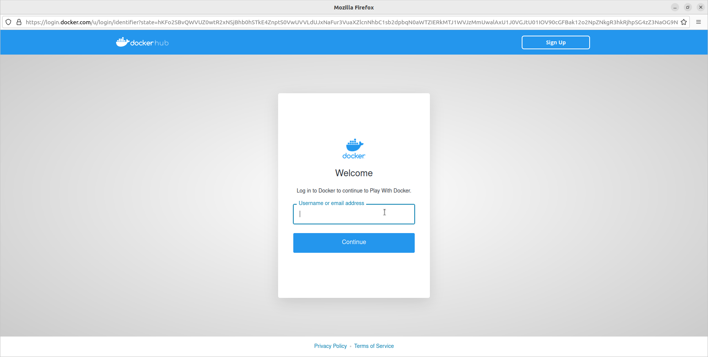
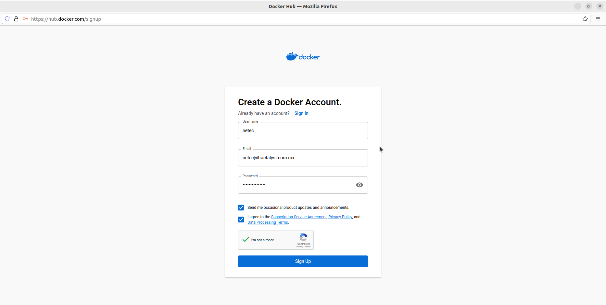
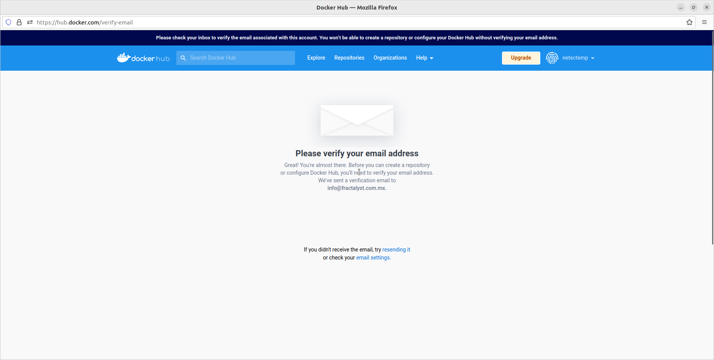
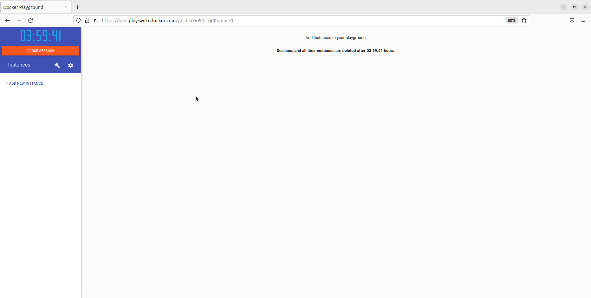
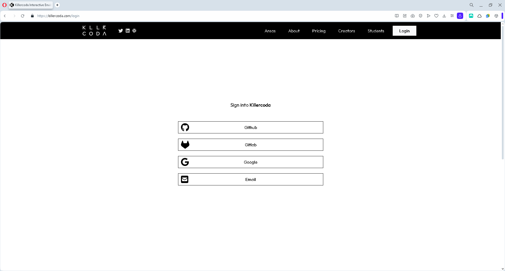
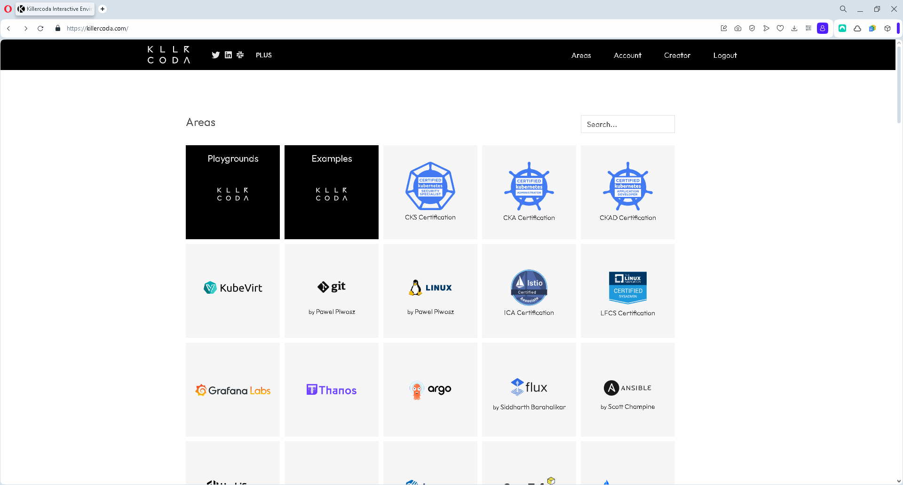
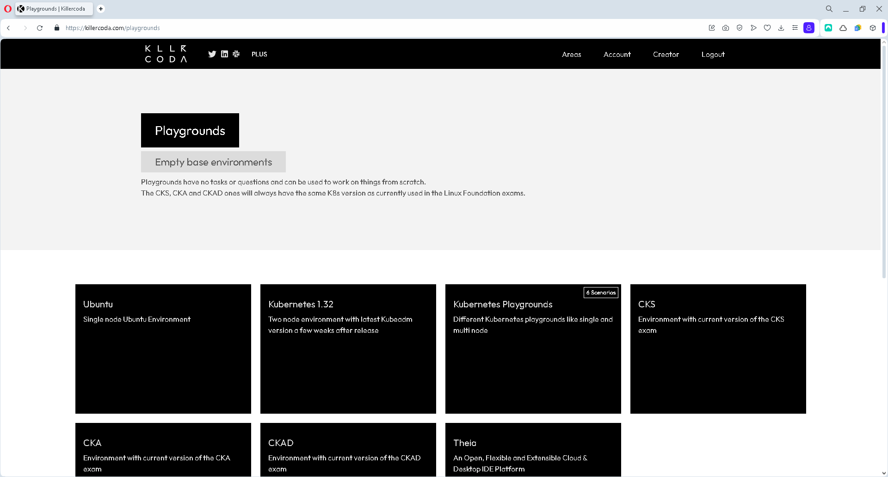
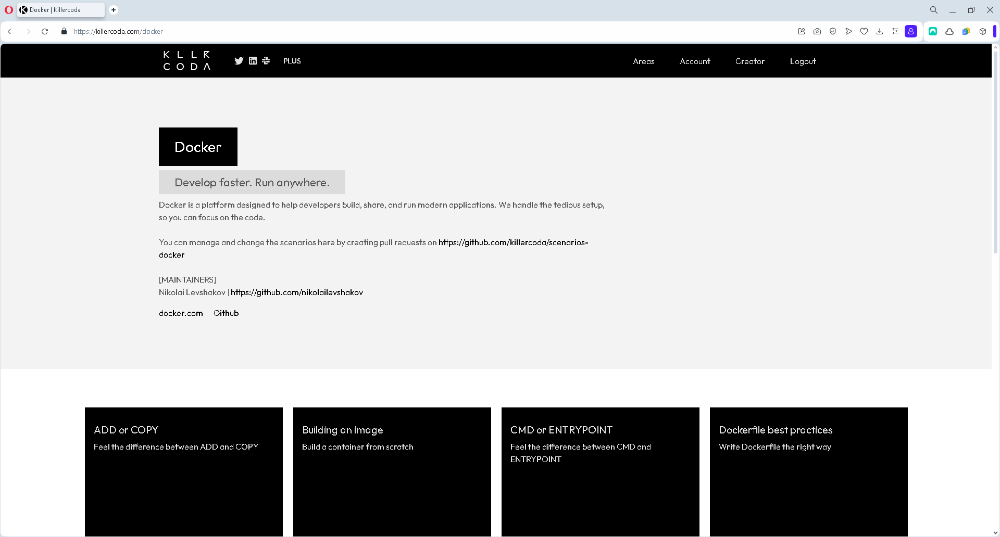
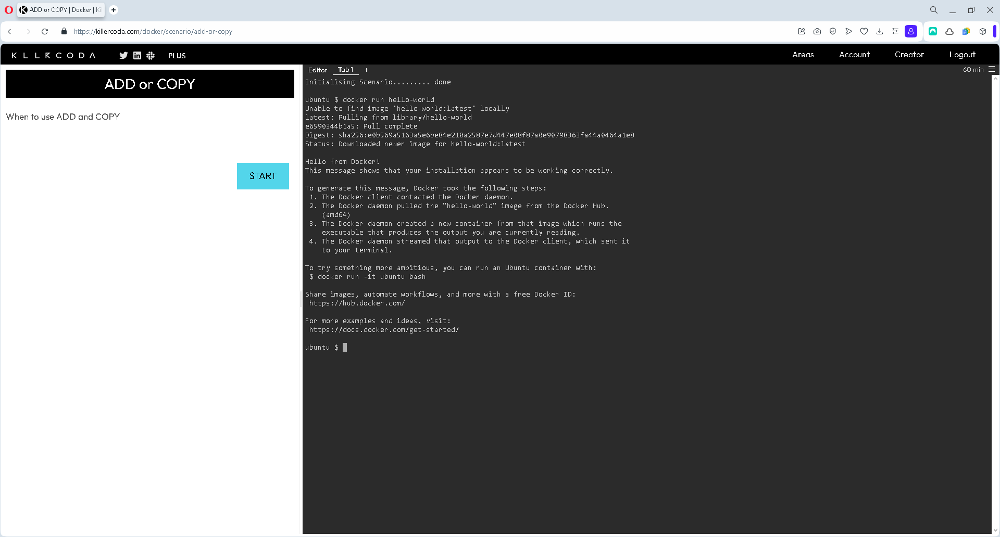

# Práctica 8.2. Docker / PWD - Killercoda - Ubuntu

## Objetivos de la práctica:

Al termino de este capítulo, serás capaz de:

- Interactuar con Docker mediante los comandos esenciales.

## Duración aproximada:
- 30 minutos.

## PRERREQUISITOS

Para esta actividad se requiere:

- Acceso a Internet.
- Acceso mediante SSH a un servidor Linux.
- Actividad anterior completada.

## Instrucciones

En esta actividad, se adquiere conocimiento sobre los comandos fundamentales de Docker.

### Entorno

#### Ubuntu

En esta actividad, se utiliza el entorno de laboratorio en línea previamente instalado en Ubuntu.

Si por alguna razón no se cuenta con un entorno de laboratorio en línea, se pueden utilizar las siguientes opciones de esta guía.

#### [Play With Docker](https://labs.play-with-docker.com)

Play With Docker es un entorno de laboratorio que permite a los usuarios ejecutar contenedores Docker en un entorno de laboratorio en línea sin tener que instalar Docker en su sistema local.

A continuación, se describen los pasos para acceder a Play With Docker mediante instantáneas de pantalla que muestran el proceso de registro y acceso.












#### [Killercoda](https://www.killercoda.com)

Killercoda es un entorno de laboratorio en línea que permite a los usuarios ejecutar contenedores Docker en un entorno de laboratorio en línea sin tener que instalar Docker en su sistema local.

A continuación, se describen los pasos para acceder a Killercoda mediante instantáneas de pantalla que muestran el proceso de registro y acceso.

Autenficación en Killercoda con alguna de las siguientes opciones:

- GitHub
- GitLab
- Google
- Email

Sigue los pasos según la opción seleccionada.





##### Playgrounds



###### Escenarios Ubuntu


##### Escenarios Docker





### Comandos

En una terminal de comandos analizar y ejecutar los comandos indicados en las siguientes secciones.

#### Descargar una imagen

``` shell
docker pull busybox
```

La salida de la ejecución debe ser similar a:

``` text
Using default tag: latest
latest: Pulling from library/busybox
22b70bddd3ac: Pull complete
Digest: sha256:6bdd92bf5240be1b5f3bf71324f5e371fe59f0e153b27fa1f1620f78ba16963c
Status: Downloaded newer image for busybox:latest
docker.io/library/busybox:latest
```

#### Listar imágenes

``` shell
docker image ls
```

La salida de la ejecución debe ser similar a:

``` text
REPOSITORY   TAG       IMAGE ID       CREATED       SIZE
busybox      latest    bc01a3326866   3 weeks ago   1.24MB
```

#### Crear un contenedor

``` shell
docker run busybox
```

La terminal no muestra información después de la ejecución del comando.

Otra opción para crear un contenedor:

``` shell
docker run busybox echo "Hola Busybox!"
```

La salida de la ejecución debe ser similar a:

``` text
Hola Busybox!
```

#### Mostrar contenedores en ejecución

``` shell
docker container ls
docker ps
```

La salida de la ejecución debe ser similar a:

``` text
CONTAINER ID   IMAGE     COMMAND   CREATED   STATUS    PORTS     NAMES
```

#### Mostrar contenedores

``` shell
docker container ls --all
docker ps -a
```

La salida de la ejecución debe ser similar a:

``` text
CONTAINER ID   IMAGE     COMMAND                 CREATED         STATUS                     PORTS     NAMES
12f5c4d09b13   busybox   "echo 'Hola Busybox'"   2 minutes ago   Exited (0) 2 minutes ago             hopeful_hertz
6145c702d7e2   busybox   "sh"                    4 minutes ago   Exited (0) 4 minutes ago             stupefied_gagarin
```

#### Interactuar con el contenedor

``` shell
docker run -it busybox sh
```

La salida de la ejecución debe ser similar a:

``` text
/ #
```

Pruebe con los comandos `ls`, `uname -a`, etcétera. Para salir lance el comando `exit`.

La salida de la ejecución debe ser similar a:

``` text
/ # ls
bin   dev   etc   home  proc  root  sys   tmp   usr   var
/ # uname -a
Linux e4fdb3668de9 4.4.0-210-generic #242-Ubuntu SMP Fri Apr 16 09:57:56 UTC 2021 x86_64 GNU/Linux
/ # exit
```

#### Eliminar contenedores

``` shell
docker rm 12f5c4d09b13 6145c702d7e2
```

Los códigos en el comando son identificadores de los contenedores, por lo que deben ser sustituidos por los que correspondan.

La salida de la ejecución debe ser similar a:

``` text
12f5c4d09b13
6145c702d7e2
```

Ahora muestra los contenedores:

``` shell
docker ps -a
```

La salida de la ejecución debe ser similar a:

``` text
CONTAINER ID   IMAGE     COMMAND   CREATED          STATUS                     PORTS     NAMES
6046758ba3d6   busybox   "sh"      11 seconds ago   Exited (0) 7 seconds ago             sad_pascal
```

##### Eliminar contenedores detenidos

``` shell
docker container prune
```

La salida de la ejecución debe ser similar a:

``` text
WARNING! This will remove all stopped containers.
Are you sure you want to continue? [y/N] y
Deleted Containers:
6046758ba3d600f8d8949573d4e6e2d0ed6f0cd016e8b4eec884d60a0cb55bac

Total reclaimed space: 5B
```

Muestra los contenedores:

``` shell
docker ps -a
```

La salida de la ejecución debe ser similar a:

``` text
CONTAINER ID   IMAGE     COMMAND   CREATED          STATUS                     PORTS     NAMES
```

## Resultado

Al finalizar esta actividad, el participante será capaz de interactuar con Docker mediante los comandos esenciales.
