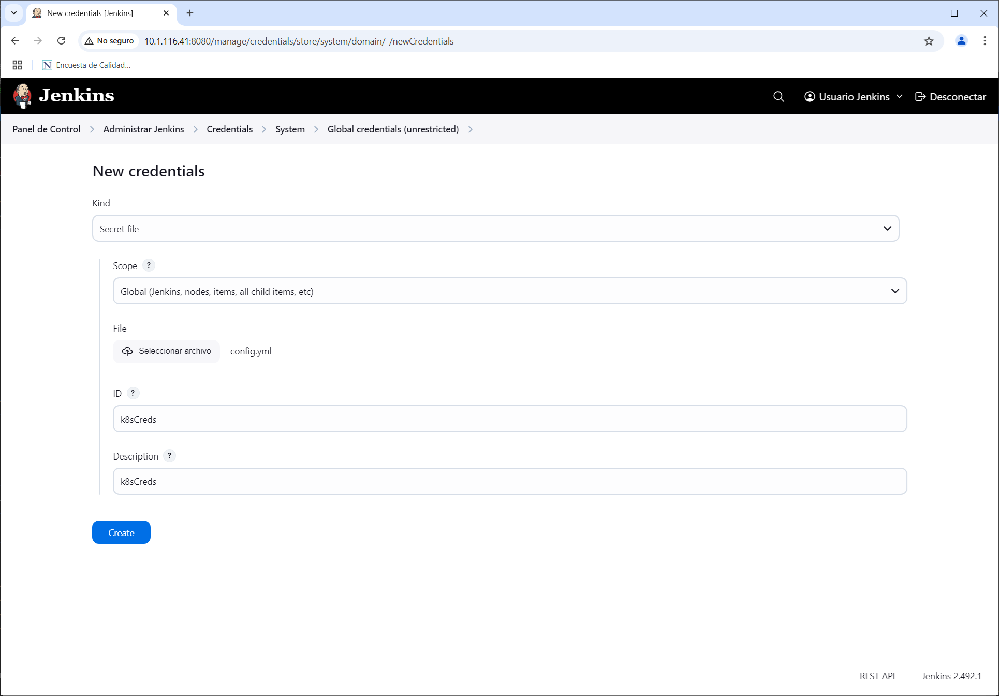
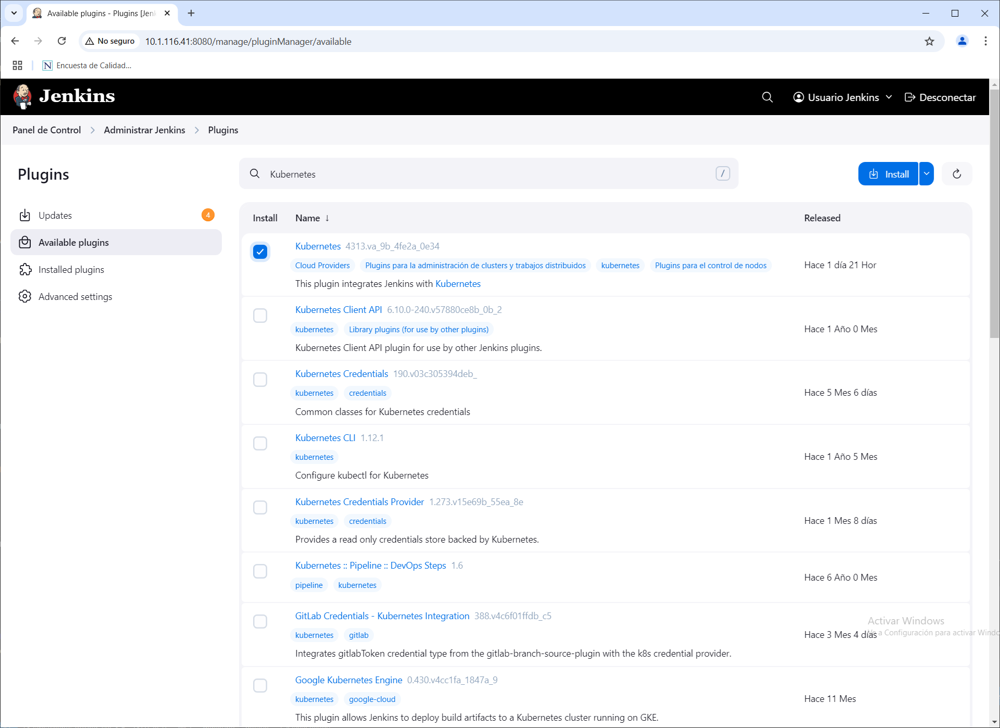
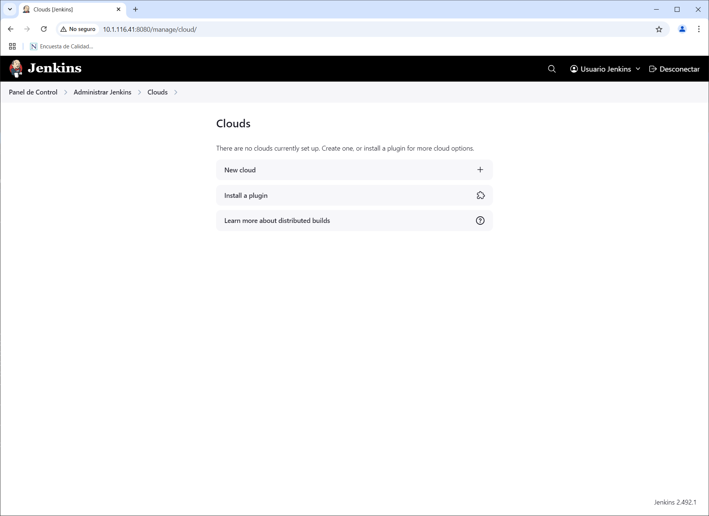
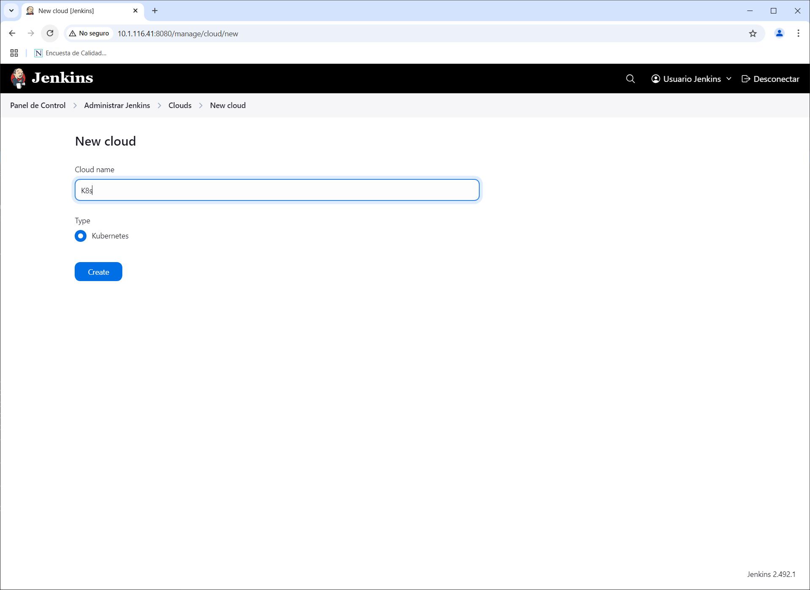
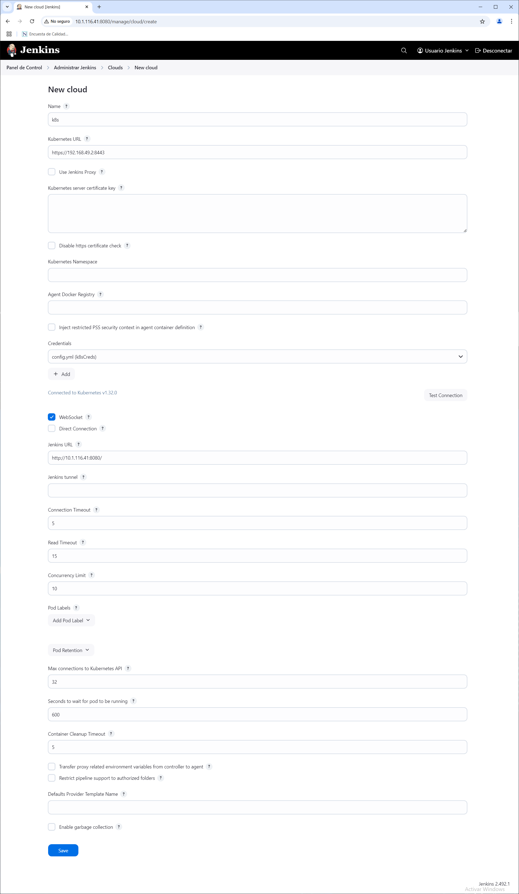
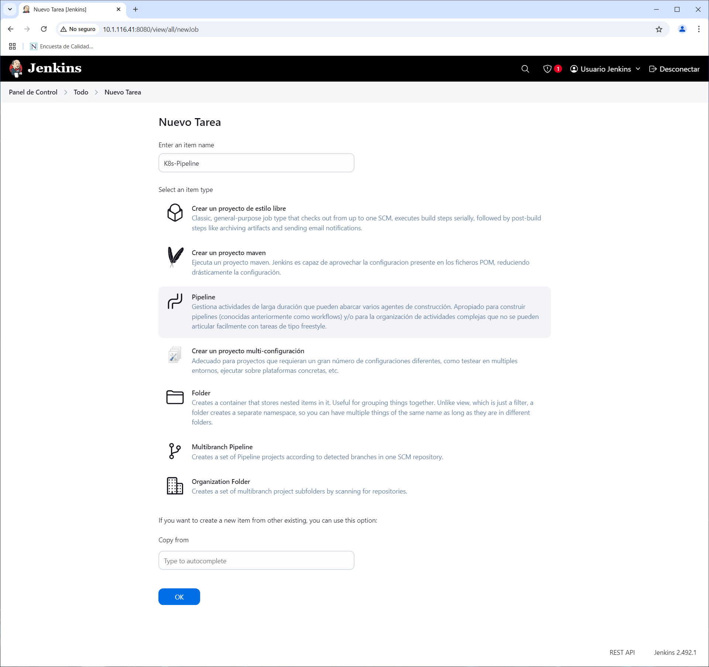
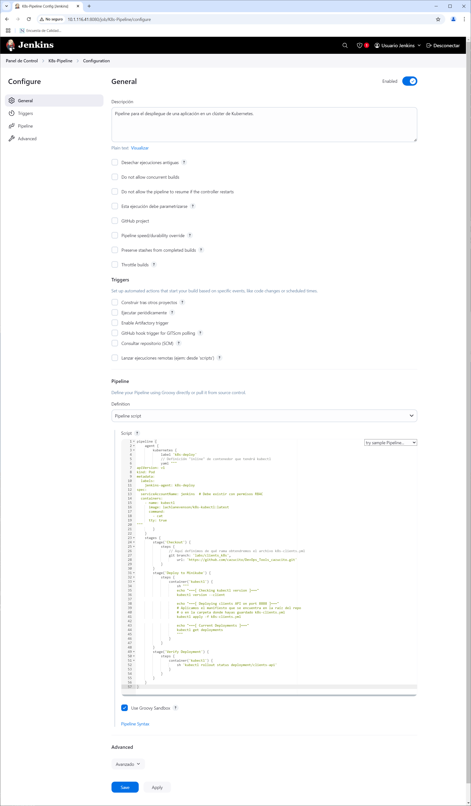
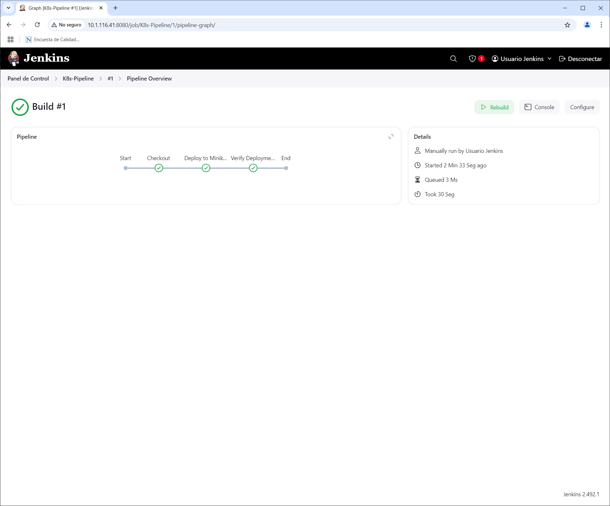

# K8S / KUBERNETES & JENKINS

## OBJETIVOS

Al termino de este capítulo, serás capaz de:

- Al finalizar serás capaz de automatizar el despliegue de aplicaciones en Kubernetes mediante Jenkins.

## DURACIÓN

Tiempo aproximado para esta actividad:

- 60 minutos.

## PRERREQUISITOS

Para esta actividad se requiere:

- Acceso a Internet.
- Acceso mediante SSH a un servidor Linux.
- Actividades anteriores del capítulo completadas.

## INSTRUCCIONES

### REQUERIMIENTOS PREVIOS

#### Credenciales de acceso a un clúster de Kubernetes

Para poder realizar esta actividad es necesario contar con las credenciales de acceso a un clúster de Kubernetes. Estas credenciales permitirán a Jenkins interactuar con el clúster para desplegar aplicaciones.

El archivo de configuración de Kubernetes se encuentra en la ruta `/home/netec/.kube/config` y contiene la información necesaria para acceder al clúster.

Para visualizar el contenido del archivo de configuración de Kubernetes, se puede ejecutar el siguiente comando:

``` shell
kubectl config view
```

La salida de la ejecución debe ser similar a:

``` yaml
apiVersion: v1
clusters:
- cluster:
    certificate-authority: /home/netec/.minikube/ca.crt
    extensions:
  - extension:
        last-update: Thu, 20 Feb 2025 22:33:40 CST
        provider: minikube.sigs.k8s.io
        version: v1.35.0
      name: cluster_info
    server: https://192.168.49.2:8443
  name: minikube
contexts:
- context:
    cluster: minikube
    extensions:
  - extension:
        last-update: Thu, 20 Feb 2025 22:33:40 CST
        provider: minikube.sigs.k8s.io
        version: v1.35.0
      name: context_info
    namespace: default
    user: minikube
  name: minikube
current-context: minikube
kind: Config
preferences: {}
users:
- name: minikube
  user:
    client-certificate: /home/netec/.minikube/profiles/minikube/client.crt
    client-key: /home/netec/.minikube/profiles/minikube/client.key
```

- Recuerda que la información es particular de cada clúster y puede variar.

Crea un archivo en el sistema anfitrión (Windows) con el contenido del archivo de configuración de Kubernetes y guárdalo en alguna ruta (por ejemplo, en el escritorio) con el nombre `config.yml`.

En la aplicación de Jenkins, se debe agregar un archivo de credenciales de Kubernetes para poder interactuar con el clúster. Para ello, se debe acceder a la sección de credenciales de Jenkins y seleccionar la opción de agregar un nuevo archivo de credenciales de Kubernetes.

Da cic en el botón Add Credentials en la siguiente pantalla en Jenkins:

Ahora ubica tu navegador en <http://10.1.116.41:8080/manage/credentials/store/system/domain/_/> y da clic en el botón Add Credentials.

- Recuerda que la IP debe ser la de tu servidor de Jenkins.

Datos para Add Credentials:

- **Kind**: `Secret file`
- **File**: Selecciona el archivo `config.yml` que creaste anteriormente.
- **ID**: `k8sCreds`
- **Description**: `k8sCreds`

Clic en el botón `Create`.



##### Permisos

Para que Jenkins utilice las llaves de acceso al clúster de Kubernetes, se pueden cambiar los permisos al archivo `client.key`.

Para ello, se debe ejecutar el siguiente comando en el clúster de Jenkins:

``` shell
chmod +r /home/netec/.minikube/profiles/minikube/client.key
```

La ejecución del comando no debe mostrar mensaje de error.

#### Cuenta de servicio de Kubernetes

Para poder desplegar aplicaciones en un clúster de Kubernetes, es necesario contar con una cuenta de servicio que tenga los permisos necesarios para interactuar con el clúster. Esta cuenta de servicio se debe crear en el clúster de Kubernetes y se debe asignar un rol que le permita desplegar aplicaciones.

Para crear una cuenta de servicio en Kubernetes, se debe crear un archivo de configuración (`serviceAccount-jenkins.yml`) de Kubernetes con la siguiente información:

``` yaml
apiVersion: v1
kind: Namespace
metadata:
  name: jenkins
---
apiVersion: v1
kind: ServiceAccount
metadata:
  name: jenkins
  namespace: default
---
kind: ClusterRole
apiVersion: rbac.authorization.k8s.io/v1
metadata:
  name: jenkins-admin
rules:
  # Recursos del API principal ("")
- apiGroups: [""]
  resources: ["pods", "pods/exec", "services", "configmaps", "secrets", "persistentvolumeclaims"]
  verbs: ["create", "delete", "get", "list", "watch", "patch", "update"]

  # Recursos del API apps
- apiGroups: ["apps"]
  resources: ["deployments", "replicasets", "daemonsets", "statefulsets"]
  verbs: ["create", "delete", "get", "list", "watch", "patch", "update"]

  # Recursos del API batch (ej. Jobs, CronJobs)
- apiGroups: ["batch"]
  resources: ["jobs", "cronjobs"]
  verbs: ["create", "delete", "get", "list", "watch", "patch", "update"]

  # Recursos del API extensions (ej. Ingresses si aplica)
- apiGroups: ["extensions"]
  resources: ["ingresses"]
  verbs: ["create", "delete", "get", "list", "watch", "patch", "update"]
---
kind: ClusterRoleBinding
apiVersion: rbac.authorization.k8s.io/v1
metadata:
  name: jenkins-admin-binding
subjects:
  - kind: ServiceAccount
    name: jenkins
    namespace: default
roleRef:
  kind: ClusterRole
  name: jenkins-admin
  apiGroup: rbac.authorization.k8s.io
```

Para aplicar la configuración de la cuenta de servicio en Kubernetes, se debe ejecutar el siguiente comando:

``` shell
kubectl apply -f serviceAccount-jenkins.yml
```

La salida de la ejecución debe ser similar a:

``` text
namespace/jenkins created
serviceaccount/jenkins created
clusterrole.rbac.authorization.k8s.io/jenkins-admin created
clusterrolebinding.rbac.authorization.k8s.io/jenkins-admin-binding created
```

##### Complemento Kubernetes

Para poder realizar esta actividad es necesario tener instalado el complemento de Kubernetes en Jenkins. Este complemento permite a Jenkins interactuar con un clúster de Kubernetes para desplegar aplicaciones.



##### Crear un nuevo clúster en Jenkins

Para poder desplegar aplicaciones en un clúster de Kubernetes, es necesario tener configurado un clúster en Jenkins. Para ello, se debe acceder a la sección de configuración de Jenkins y seleccionar la opción de agregar un nuevo `Cloud` de Kubernetes.



- **New cloud**:
  - **Name**: `k8s`
  - **Type**: `Kubernetes`

Click en el botón `Create`.



- **New cloud**:
  - **Kubernetes URL**: `https://192.168.49.2.8443`
    - El valor es el de la propiedad `server` del archivo de configuración de Kubernetes.
  - **Credentials**: `k8sCreds`
  - **WebSocket**: `Selecionado`
  - **Jenkins URL**: `http://10.1.116.41:8080/`
    - El valor es la IP del servidor de Jenkins.



Click en el botón `Test Connection` para verificar la conexión con el clúster de Kubernetes.

- Debe aparecer una leyenda similar a `Connection to Kunernetes v1.32.0`.

Por último, clic en el botón `Save`.

#### Manifiesto de Kubernetes

El archivo `k8s-clients.yml` es un manifiesto de Kubernetes que define los recursos necesarios para desplegar la aplicación `clients-api` en un clúster de Kubernetes.

A continuación, se muestra su contenido y dónde se encuentra ubicado en el repositorio.

##### Repositorio

En tu repositorio de trabajo (el bifurcado de `DevOps_Tools`) crea (y cámbiate) una nueva rama llamada `labs/clients_k8s_TU_NOMBRE` a partir de `labs/clients`.

En la nueva rama, crea el archivo `k8s-clients.yml` con el siguiente contenido:

``` yaml
apiVersion: apps/v1
kind: Deployment
metadata:
  name: clients-api
  labels:
    app: clients-api
spec:
  replicas: 1
  selector:
    matchLabels:
      app: clients-api
  template:
    metadata:
      labels:
        app: clients-api
    spec:
      containers:
    - name: clients
        image: netecdev/clients:0.1.0
        # Asegúrate de que la aplicación dentro de la imagen
        # realmente escuche en el puerto 8888.
        ports:
    - containerPort: 8888
---
apiVersion: v1
kind: Service
metadata:
  name: clients-api-service
  labels:
    app: clients-api
spec:
  selector:
    app: clients-api
  ports:
  - port: 8888
      targetPort: 8888
      protocol: TCP
      name: http
  # NodePort para poder acceder en Minikube desde tu host
  type: NodePort
```

Asegúrate de entender cada una de las secciones del archivo.

Aunque la información debería ser funcional, deberías hacer los ajustes necesarios para *apuntar* a tu repositorio y a tu imagen.

Una vez que hayas creado el archivo, súbelo a tu repositorio.

- Realiza un `commit` con el mensaje `Agrega manifiesto de Kubernetes para clients-api`.

- Realiza un `push` a la rama `labs/clients_k8s_TU_NOMBRE`.

### PIPELINE

#### Creación de un nuevo proyecto

Para la creación del *pipeline* se debe realizar lo siguiente:

1. En el *Dashboard* de *Jenkins* dar clic en el botón `New Item`.
2. Ingresar el nombre del *pipeline* como `K8s-Pipeline` y seleccionar la opción `Pipeline`.
3. Dar clic en el botón `OK`.



##### Pipeline Script

En la sección de configuración del *pipeline* realizar lo siguiente:

- **Pipeline**
  - **Definition**: `Pipeline script`

En el campo de script, copiar el siguiente código:

``` groovy
pipeline {
    agent {
        kubernetes {
            label 'k8s-deploy'
            // Definición "inline" de contenedor que tendrá kubectl
            yaml """
apiVersion: v1
kind: Pod
metadata:
  labels:
    jenkins-agent: k8s-deploy
spec:
  serviceAccountName: jenkins  # Debe existir con permisos RBAC
  containers:
  - name: kubectl
      image: lachlanevenson/k8s-kubectl:latest
      command:
    - cat
      tty: true
"""
        }
    }
    stages {
        stage('Checkout') {
            steps {
                // Aquí definimos de qué rama obtendremos el archivo k8s-clients.yml
                git branch: 'labs/clients_k8s',
                    url: 'https://github.com/cazucito/DevOps_Tools_cazucito.git'
            }
        }
        stage('Deploy to Minikube') {
            steps {
                container('kubectl') {
                    sh """
                    echo "===[ Checking kubectl version ]==="
                    kubectl version --client

                    echo "===[ Deploying clients API on port 8888 ]==="
                    # Aplicamos el manifiesto que se encuentra en la raíz del repo
                    # o en la carpeta donde hayas guardado k8s-clients.yml
                    kubectl apply -f k8s-clients.yml

                    echo "===[ Current Deployments ]==="
                    kubectl get deployments
                    """
                }
            }
        }
        stage('Verify Deployment') {
            steps {
                container('kubectl') {
                    sh 'kubectl rollout status deployment/clients-api'
                }
            }
        }
    }
}
```

Dar clic en el botón `Save`.



Dedica un momento a revisar el script del *pipeline* y asegúrate de entender cada una de las secciones.

#### Ejecución

##### Objetos en el clúster de Kubernetes

Antes de ejecutar el *pipeline* revisa los objetos existentes en el clúster de Kubernetes, con el comando:

``` shell
kubectl get all
```

La salida de la ejecución debe ser similar a:

``` text
NAME                 TYPE        CLUSTER-IP   EXTERNAL-IP   PORT(S)   AGE
service/kubernetes   ClusterIP   10.96.0.1    <none>        443/TCP   19h
```

La salida indica que no hay objetos *propios* en el clúster de Kubernetes.

##### Ejecución del Pipeline

Para ejecutar el *pipeline* se debe realizar lo siguiente:

1.  En el *Dashboard* de *Jenkins* dar clic en el *pipeline* `K8s-Pipeline`.
2.  En la parte superior derecha, dar clic en el botón `Build Now`.

Analiza la salida de la ejecución del *pipeline* y verifica que no haya errores.

``` text
Started by user Usuario Jenkins
[Pipeline] Start of Pipeline
[Pipeline] echo
[WARNING] label option is deprecated. To use a static pod template, use the 'inheritFrom' option.
[Pipeline] podTemplate
[Pipeline] {
[Pipeline] node
Created Pod: k8s default/k8s-deploy-lcz77-jm3kj
[PodInfo] default/k8s-deploy-lcz77-jm3kj
    Container [jnlp] waiting [ContainerCreating] No message
    Container [kubectl] waiting [ContainerCreating] No message
    Pod [Pending][ContainersNotReady] containers with unready status: [kubectl jnlp]
Agent k8s-deploy-lcz77-jm3kj is provisioned from template k8s-deploy-lcz77
---
apiVersion: "v1"
kind: "Pod"
metadata:
  annotations:
    kubernetes.jenkins.io/last-refresh: "1740163595716"
    buildUrl: "http://10.1.116.41:8080/job/K8s-Pipeline/1/"
    runUrl: "job/K8s-Pipeline/1/"
  labels:
    jenkins-agent: "k8s-deploy"
    jenkins: "slave"
    jenkins/label-digest: "757ef7af22470bde1b9a388c22dca4524cdf0f1a"
    jenkins/label: "k8s-deploy"
    kubernetes.jenkins.io/controller: "http___10_1_116_41_8080x"
  name: "k8s-deploy-lcz77-jm3kj"
spec:
  containers:
  - command:
  - "cat"
    image: "lachlanevenson/k8s-kubectl:latest"
    name: "kubectl"
    tty: true
    volumeMounts:
  - mountPath: "/home/jenkins/agent"
      name: "workspace-volume"
      readOnly: false
  - env:
  - name: "JENKINS_SECRET"
      value: "********"
  - name: "JENKINS_AGENT_NAME"
      value: "k8s-deploy-lcz77-jm3kj"
  - name: "JENKINS_WEB_SOCKET"
      value: "true"
  - name: "REMOTING_OPTS"
      value: "-noReconnectAfter 1d"
  - name: "JENKINS_NAME"
      value: "k8s-deploy-lcz77-jm3kj"
  - name: "JENKINS_AGENT_WORKDIR"
      value: "/home/jenkins/agent"
  - name: "JENKINS_URL"
      value: "http://10.1.116.41:8080/"
    image: "jenkins/inbound-agent:3283.v92c105e0f819-8"
    name: "jnlp"
    resources:
      requests:
        memory: "256Mi"
        cpu: "100m"
    volumeMounts:
  - mountPath: "/home/jenkins/agent"
      name: "workspace-volume"
      readOnly: false
  nodeSelector:
    kubernetes.io/os: "linux"
  restartPolicy: "Never"
  serviceAccountName: "jenkins"
  volumes:
  - emptyDir:
      medium: ""
    name: "workspace-volume"

Running on k8s-deploy-lcz77-jm3kj in /home/jenkins/agent/workspace/K8s-Pipeline
[Pipeline] {
[Pipeline] stage
[Pipeline] { (Checkout)
[Pipeline] git
The recommended git tool is: NONE
No credentials specified
Cloning the remote Git repository
Cloning repository https://github.com/cazucito/DevOps_Tools_cazucito.git
 > git init /home/jenkins/agent/workspace/K8s-Pipeline # timeout=10
Fetching upstream changes from https://github.com/cazucito/DevOps_Tools_cazucito.git
 > git --version # timeout=10
 > git --version # 'git version 2.39.5'
 > git fetch --tags --force --progress -- https://github.com/cazucito/DevOps_Tools_cazucito.git +refs/heads/*:refs/remotes/origin/* # timeout=10
 > git config remote.origin.url https://github.com/cazucito/DevOps_Tools_cazucito.git # timeout=10
 > git config --add remote.origin.fetch +refs/heads/*:refs/remotes/origin/* # timeout=10
Avoid second fetch
Checking out Revision 01affe580ea5334ace9df10fd5b2c9b39ff291f4 (refs/remotes/origin/labs/clients_k8s)
 > git rev-parse refs/remotes/origin/labs/clients_k8s^{commit} # timeout=10
 > git config core.sparsecheckout # timeout=10
 > git checkout -f 01affe580ea5334ace9df10fd5b2c9b39ff291f4 # timeout=10
 > git branch -a -v --no-abbrev # timeout=10
 > git checkout -b labs/clients_k8s 01affe580ea5334ace9df10fd5b2c9b39ff291f4 # timeout=10
Commit message: "k8s manifest"
First time build. Skipping changelog.
[Pipeline] }
[Pipeline] // stage
[Pipeline] stage
[Pipeline] { (Deploy to Minikube)
[Pipeline] container
[Pipeline] {
[Pipeline] sh
+ echo '===[ Checking kubectl version ]==='
===[ Checking kubectl version ]===
+ kubectl version --client
WARNING: This version information is deprecated and will be replaced with the output from kubectl version --short.  Use --output=yaml|json to get the full version.
Client Version: version.Info{Major:"1", Minor:"25", GitVersion:"v1.25.4", GitCommit:"872a965c6c6526caa949f0c6ac028ef7aff3fb78", GitTreeState:"clean", BuildDate:"2022-11-09T13:36:36Z", GoVersion:"go1.19.3", Compiler:"gc", Platform:"linux/amd64"}
Kustomize Version: v4.5.7
+ echo '===[ Deploying clients API on port 8888 ]==='
===[ Deploying clients API on port 8888 ]===
+ kubectl apply -f k8s-clients.yml
deployment.apps/clients-api created
service/clients-api-service created
+ echo '===[ Current Deployments ]==='
===[ Current Deployments ]===
+ kubectl get deployments
NAME          READY   UP-TO-DATE   AVAILABLE   AGE
clients-api   0/1     1            0           1s
[Pipeline] }
[Pipeline] // container
[Pipeline] }
[Pipeline] // stage
[Pipeline] stage
[Pipeline] { (Verify Deployment)
[Pipeline] container
[Pipeline] {
[Pipeline] sh
+ kubectl rollout status deployment/clients-api
Waiting for deployment "clients-api" rollout to finish: 0 of 1 updated replicas are available...
deployment "clients-api" successfully rolled out
[Pipeline] }
[Pipeline] // container
[Pipeline] }
[Pipeline] // stage
[Pipeline] }
Agent k8s-deploy-lcz77-jm3kj was deleted, but do not have a node body to cancel
[Pipeline] // node
[Pipeline] }
[Pipeline] // podTemplate
[Pipeline] End of Pipeline
Finished: SUCCESS
```

Tambien puedes revisar el *pipeline* en el *Dashboard* de *Jenkins*.



#### Consumo

##### Objetos en el clúster

Para verificar que la aplicación `clients-api` se encuentra en ejecución, se debe realizar lo siguiente:

``` shell
kubectl get all
```

La salida de la ejecución debe ser similar a:

``` text
NAME                             READY   STATUS    RESTARTS   AGE
pod/clients-api-6f5c65f5-p6m6q   1/1     Running   0          5m17s

NAME                          TYPE        CLUSTER-IP     EXTERNAL-IP   PORT(S)          AGE
service/clients-api-service   NodePort    10.97.161.76   <none>        8888:32321/TCP   5m18s
service/kubernetes            ClusterIP   10.96.0.1      <none>        443/TCP          19h

NAME                          READY   UP-TO-DATE   AVAILABLE   AGE
deployment.apps/clients-api   1/1     1            1           5m18s

NAME                                   DESIRED   CURRENT   READY   AGE
replicaset.apps/clients-api-6f5c65f5   1         1         1       5m18s
```

La salida indica que se han creado los objetos de nuestra aplicación:

- Pod: `clients-api-*`

- Deployment: `clients-api`

- Servicio: `clients-api-service`.

##### Dirección IP del servicio

Dentro de Minikube, se puede obtener la dirección IP del servicio `clients-api-service` con el comando:

``` shell
minikube service clients-api-service --url
```

La salida de la ejecución debe ser similar a:

``` text
http://192.168.49.2:32321
```

La dirección obtenida es a la que se puede acceder a la aplicación `clients-api`.

##### Petición a la Aplicación

Para verificar que la aplicación `clients-api` responde correctamente, se puede realizar una petición con `curl` a la dirección IP del servicio:

``` shell
curl http://192.168.49.2:32321/clients/13
```

La salida de la ejecución debe ser similar a:

``` json
{
    "idClient": 13,
    "name": "Mariana",
    "surname": "Montes"
}
```

##### Exploración

Dedique unos minutos a explorar el clúster de Kubernetes y revise los objetos creados por el *pipeline*.

- ¿Qué objetos se crearon?

- ¿Qué información contienen?

- ¿Qué relación tienen entre ellos?

Recuerda que puedes utilizar `kubectl` o la extensión de Kubernetes para Visual Studio Code para explorar los objetos del clúster.

## RESULTADO

Al finalizar serás capaz de automatizar el despliegue de aplicaciones en Kubernetes mediante Jenkins.


## RESTABLECIMIENTO

### Aplicación

Para dar de baja el pod, el deployment y el servicio de la aplicación `clients-api`. PAra el despliegue de la aplicación, Kubernetes crea un deployment, un pod y un servicio. Para eliminar estos recursos, para consultar los recursos creados, se puede ejecutar el siguiente comando:

``` shell
kubectl get all
```

La salida de la ejecución debe ser similar a:

``` text
NAME                              READY   STATUS    RESTARTS   AGE
NAME                             READY   STATUS    RESTARTS   AGE
pod/clients-api-6f5c65f5-p6m6q   1/1     Running   0          14m

NAME                          TYPE        CLUSTER-IP     EXTERNAL-IP   PORT(S)          AGE
service/clients-api-service   NodePort    10.97.161.76   <none>        8888:32321/TCP   14m
service/kubernetes            ClusterIP   10.96.0.1      <none>        443/TCP          19h

NAME                          READY   UP-TO-DATE   AVAILABLE   AGE
deployment.apps/clients-api   1/1     1            1           14m

NAME                                   DESIRED   CURRENT   READY   AGE
replicaset.apps/clients-api-6f5c65f5   1         1         1       14m
```

#### Servicio

Para eliminar el servicio, se debe ejecutar el siguiente comando:

``` shell
kubectl delete service clients-api-service
```

La salida de la ejecución debe ser similar a:

``` text
service "clients-api-service" deleted
```

#### Deployment

Para eliminar el deployment (y el pod), se debe ejecutar el siguiente comando:

``` shell
kubectl delete deployment clients-api
```

La salida de la ejecución debe ser similar a:

``` text
deployment.apps "clients-api" deleted
```

#### Verificación

Para verificar que los recursos fueron eliminados, se puede ejecutar el siguiente comando:

``` shell
kubectl get all
```

La salida de la ejecución debe ser similar a:

``` text
NAME                 TYPE        CLUSTER-IP   EXTERNAL-IP   PORT(S)   AGE
service/kubernetes   ClusterIP   10.96.0.1    <none>        443/TCP   14h
```

### Minikube

Es importante que después de realizar las pruebas, se detenga el clúster de Kubernetes para liberar los recursos del sistema.

``` shell
minikube stop
```

La salida de la ejecución debe ser similar a:

``` text
✋  Stopping node "minikube"  ...
🛑  Powering off "minikube" via SSH ...
🛑  1 node stopped.
```
