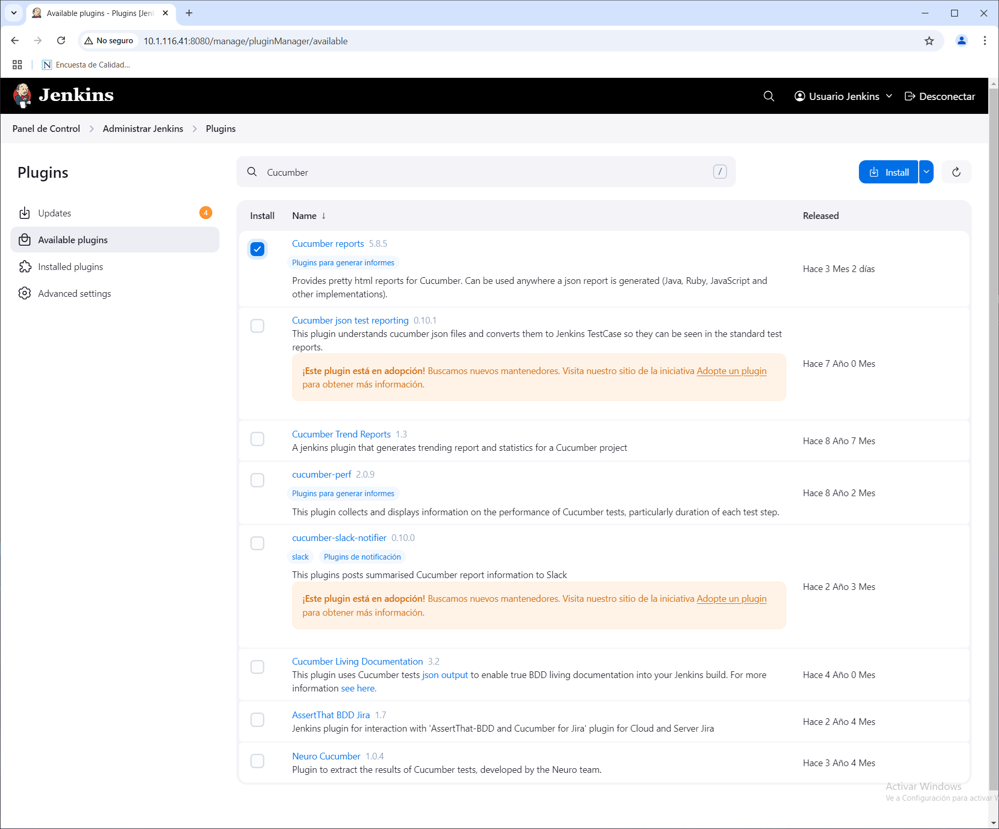
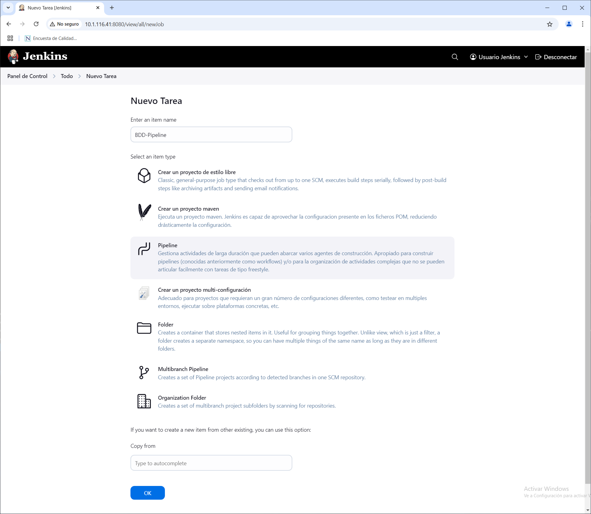
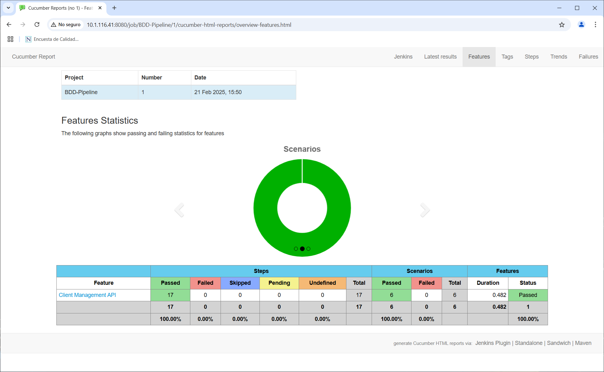
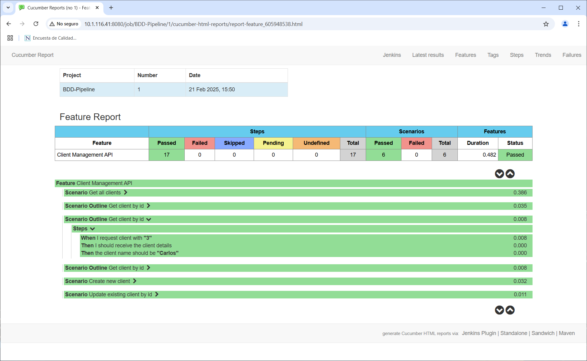

# Práctica 10. Pruebas de integración

## Objetivos de la práctica:

Al termino de este capítulo, serás capaz de:

- Entender y ejecutar pruebas de integración con Cucumber mediante un pipeline de Jenkins.

## Duración aproximada:
- 50 minutos.

## Prerrequisitos

Para esta actividad se requiere:

- Acceso a Internet.
- Acceso mediante SSH a un servidor Linux.

## Intrucciones

### Requerimientos previos 

#### Complemento Cucumber Reports

Para poder realizar esta actividad es necesario tener instalado el complemento de **Cucumber Reports** en Jenkins. Este complemento permite a Jenkins generar reportes de las pruebas de integración realizadas con Cucumber.



Así, Jenkins podrá leer los archivos `.json` de Cucumber y desplegar un informe más completo. (También puede bastar con la publicación de JUnit si tu framework genera XML.)

### Pipeline

#### Creación de un nuevo proyecto

Para la creación del *pipeline* se debe realizar lo siguiente:

1. En el *Dashboard* de *Jenkins* dar clic en el botón `New Item`.
2. Ingresar el nombre del *pipeline* como `BDD-Pipeline` y seleccionar la opción `Pipeline`.
3. Dar clic en el botón `OK`.



- Descripción del *pipeline*: `Flujo simple para ejecutar pruebas de integración con Cucumber.`

#### Pipeline Script

En la sección de configuración del *pipeline* realizar lo siguiente:

- **Pipeline**
  - **Definition**: `Pipeline script`

En el campo de script, copiar el siguiente código:

``` groovy
pipeline {
    agent any

    tools {
        // Declaras la versión de Maven que definiste en Jenkins (Manage Jenkins > Global Tool Configuration)
        maven 'default'
        jdk 'default' // o la versión que uses
    }

    stages {
        stage('Checkout') {
            steps {
                git url: 'https://github.com/Netec-Mx/DevOps_Tools.git', branch: 'labs/clients_tests_sol'
            }
        }

        stage('Build & Test') {
            steps {
                sh 'mvn clean test'
            }
        }

        stage('Publish Cucumber Reports') {
            steps {
                // Publicar reportes en JSON
                cucumber fileIncludePattern: 'target/cucumber-reports/*.json',
                         // Ajusta si deseas un nombre personalizado
                         sortingMethod: 'ALPHABETICAL'

                // O si tu plugin es distinto, podrías necesitar:
                // cucumber jsonReportDirectory: 'target/cucumber-reports'
            }
        }
    }
}
```

- Reemplazar la URL del repositorio de Git en la sección `Checkout` por la URL de tu repositorio.
- Reemplazar la rama `labs/clients_tests_TU-NOMBRE` por la rama que estás utilizando.

Dar clic en el botón `Save`.


Dedicar un momento a revisar el script del *pipeline* y asegúrate de entender cada una de las secciones.

#### Ejecución

Para ejecutar el *pipeline* se debe realizar lo siguiente:

1. En el *Dashboard* de *Jenkins* dar clic en el *pipeline* `BDD-Pipeline`.
2. En la parte superior derecha, dar clic en el botón `Build Now`.

Analizar la salida de la ejecución del *pipeline* y verificar que no haya errores.

``` text
Started by user Usuario Jenkins
[Pipeline] Start of Pipeline
[Pipeline] node
Running on Jenkins in /var/lib/jenkins/workspace/BDD-Pipeline
[Pipeline] {
[Pipeline] stage
[Pipeline] { (Declarative: Tool Install)
[Pipeline] tool
[Pipeline] envVarsForTool
[Pipeline] tool
[Pipeline] envVarsForTool
[Pipeline] }
[Pipeline] // stage
[Pipeline] withEnv
[Pipeline] {
[Pipeline] stage
[Pipeline] { (Checkout)
[Pipeline] tool
[Pipeline] envVarsForTool
[Pipeline] tool
[Pipeline] envVarsForTool
[Pipeline] withEnv
[Pipeline] {
[Pipeline] git
The recommended git tool is: NONE
No credentials specified
Cloning the remote Git repository
Cloning repository https://github.com/Netec-Mx/DevOps_Tools.git
 > git init /var/lib/jenkins/workspace/BDD-Pipeline # timeout=10
Fetching upstream changes from https://github.com/Netec-Mx/DevOps_Tools.git
 > git --version # timeout=10
 > git --version # 'git version 2.25.1'
 > git fetch --tags --force --progress -- https://github.com/Netec-Mx/DevOps_Tools.git +refs/heads/*:refs/remotes/origin/* # timeout=10
 > git config remote.origin.url https://github.com/Netec-Mx/DevOps_Tools.git # timeout=10
 > git config --add remote.origin.fetch +refs/heads/*:refs/remotes/origin/* # timeout=10
Avoid second fetch
 > git rev-parse refs/remotes/origin/labs/clients_tests_sol^{commit} # timeout=10
Checking out Revision 3c2adf080cc422ff778de722a721b5efeff18987 (refs/remotes/origin/labs/clients_tests_sol)
 > git config core.sparsecheckout # timeout=10
 > git checkout -f 3c2adf080cc422ff778de722a721b5efeff18987 # timeout=10
 > git branch -a -v --no-abbrev # timeout=10
 > git checkout -b labs/clients_tests_sol 3c2adf080cc422ff778de722a721b5efeff18987 # timeout=10
Commit message: "Fix report path"
First time build. Skipping changelog.
[Pipeline] }
[Pipeline] // withEnv
[Pipeline] }
[Pipeline] // stage
[Pipeline] stage
[Pipeline] { (Build & Test)
[Pipeline] tool
[Pipeline] envVarsForTool
[Pipeline] tool
[Pipeline] envVarsForTool
[Pipeline] withEnv
[Pipeline] {
[Pipeline] sh
+ mvn clean test
[INFO] Scanning for projects...
[INFO]
[INFO] [-----------------------< [com.netec.pocs:clients] >-----------------------]
[INFO] [Building clients 0.1.0-SNAPSHOT]
[INFO] [--------------------------------[ jar ]---------------------------------]
[INFO]
[INFO] [--- [maven-clean-plugin:3.3.2:clean] [(default-clean)] @ [clients] ---]
[INFO]
[INFO] [--- [maven-resources-plugin:3.3.1:resources] [(default-resources)] @ [clients] ---]
[INFO] Copying 1 resource from src/main/resources to target/classes
[INFO] Copying 0 resource from src/main/resources to target/classes
[INFO]
[INFO] [--- [maven-compiler-plugin:3.8.1:compile] [(default-compile)] @ [clients] ---]
[INFO] Changes detected - recompiling the module!
[INFO] Compiling 4 source files to /var/lib/jenkins/workspace/BDD-Pipeline/target/classes
[INFO]
[INFO] [--- [maven-resources-plugin:3.3.1:testResources] [(default-testResources)] @ [clients] ---]
[INFO] Copying 1 resource from src/test/resources to target/test-classes
[INFO]
[INFO] [--- [maven-compiler-plugin:3.8.1:testCompile] [(default-testCompile)] @ [clients] ---]
[INFO] Changes detected - recompiling the module!
[INFO] Compiling 3 source files to /var/lib/jenkins/workspace/BDD-Pipeline/target/test-classes
[INFO]
[INFO] [--- [maven-surefire-plugin:3.1.2:test] [(default-test)] @ [clients] ---]
[INFO] Using auto detected provider org.apache.maven.surefire.junitplatform.JUnitPlatformProvider
[INFO]
[INFO] -------------------------------------------------------
[INFO]  T E S T S
[INFO] -------------------------------------------------------
[INFO] Running com.netec.pocs.clients.[CucumberTest]
15:50:38.464 [main] INFO org.springframework.test.context.support.AnnotationConfigContextLoaderUtils -- Could not detect default configuration classes for test class [com.netec.pocs.clients.steps.ClientsSteps]: ClientsSteps does not declare any static, non-private, non-final, nested classes annotated with @Configuration.
15:50:38.674 [main] INFO org.springframework.boot.test.context.SpringBootTestContextBootstrapper -- Found @SpringBootConfiguration com.netec.pocs.clients.CrudClientsApplication for test class com.netec.pocs.clients.steps.ClientsSteps

  .   ____          _            __ _ _
 /\\ / ___'_ __ _ _(_)_ __  __ _ \ \ \ \
( ( )\___ | '_ | '_| | '_ \/ _` | \ \ \ \
 \\/  ___)| |_)| | | | | || (_| |  ) ) ) )
  '  |____| .__|_| |_|_| |_\__, | / / / /
 =========|_|==============|___/=/_/_/_/
 :: Spring Boot ::                (v3.2.2)

2025-02-21T15:50:39.391-06:00  INFO 1743412 --- [           main] c.netec.pocs.clients.steps.ClientsSteps  : Starting ClientsSteps using Java 17.0.14 with PID 1743412 (started by jenkins in /var/lib/jenkins/workspace/BDD-Pipeline)
2025-02-21T15:50:39.394-06:00  INFO 1743412 --- [           main] c.netec.pocs.clients.steps.ClientsSteps  : No active profile set, falling back to 1 default profile: "default"
2025-02-21T15:50:41.157-06:00  INFO 1743412 --- [           main] o.s.b.w.embedded.tomcat.TomcatWebServer  : Tomcat initialized with port 0 (http)
2025-02-21T15:50:41.177-06:00  INFO 1743412 --- [           main] o.apache.catalina.core.StandardService   : Starting service [Tomcat]
2025-02-21T15:50:41.178-06:00  INFO 1743412 --- [           main] o.apache.catalina.core.StandardEngine    : Starting Servlet engine: [Apache Tomcat/10.1.18]
2025-02-21T15:50:41.284-06:00  INFO 1743412 --- [           main] o.a.c.c.C.[Tomcat].[localhost].[/]       : Initializing Spring embedded WebApplicationContext
2025-02-21T15:50:41.288-06:00  INFO 1743412 --- [           main] w.s.c.ServletWebServerApplicationContext : Root WebApplicationContext: initialization completed in 1841 ms
2025-02-21T15:50:42.109-06:00  INFO 1743412 --- [           main] o.s.b.w.embedded.tomcat.TomcatWebServer  : Tomcat started on port 40347 (http) with context path ''
2025-02-21T15:50:42.133-06:00  INFO 1743412 --- [           main] c.netec.pocs.clients.steps.ClientsSteps  : Started ClientsSteps in 3.218 seconds (process running for 5.542)
OpenJDK 64-Bit Server VM warning: Sharing is only supported for boot loader classes because bootstrap classpath has been appended

Scenario: Get all clients                 [ features/clients.feature:]
2025-02-21T15:50:43.704-06:00  INFO 1743412 --- [o-auto-1-exec-1] o.a.c.c.C.[Tomcat].[localhost].[/]       : Initializing Spring DispatcherServlet 'dispatcherServlet'
2025-02-21T15:50:43.704-06:00  INFO 1743412 --- [o-auto-1-exec-1] o.s.web.servlet.DispatcherServlet        : Initializing Servlet 'dispatcherServlet'
2025-02-21T15:50:43.706-06:00  INFO 1743412 --- [o-auto-1-exec-1] o.s.web.servlet.DispatcherServlet        : Completed initialization in 1 ms
  [When ]I request all clients]              [ com.netec.pocs.clients.steps.ClientsSteps.requestAllClients()]
  [Then ]I should receive a list of clients] [ com.netec.pocs.clients.steps.ClientsSteps.i_should_receive_a_list_of_clients()]
2025-02-21T15:50:43.949-06:00  INFO 1743412 --- [           main] t.c.s.AnnotationConfigContextLoaderUtils : Could not detect default configuration classes for test class [com.netec.pocs.clients.steps.ClientsSteps]: ClientsSteps does not declare any static, non-private, non-final, nested classes annotated with @Configuration.
2025-02-21T15:50:43.954-06:00  INFO 1743412 --- [           main] .b.t.c.SpringBootTestContextBootstrapper : Found @SpringBootConfiguration com.netec.pocs.clients.CrudClientsApplication for test class com.netec.pocs.clients.steps.ClientsSteps

Scenario Outline: Get client by id         [ features/clients.feature:14]
  [When ]I request client with ]["1"]           [ com.netec.pocs.clients.steps.ClientsSteps.requestClientWithId(java.lang.String)]
  [Then ]I should receive the client details] [ com.netec.pocs.clients.steps.ClientsSteps.shouldReceiveClientDetails()]
  [Then ]the client name should be ]["Alberto"] [ com.netec.pocs.clients.steps.ClientsSteps.theClientNameShouldBe(java.lang.String)]
2025-02-21T15:50:44.034-06:00  INFO 1743412 --- [           main] t.c.s.AnnotationConfigContextLoaderUtils : Could not detect default configuration classes for test class [com.netec.pocs.clients.steps.ClientsSteps]: ClientsSteps does not declare any static, non-private, non-final, nested classes annotated with @Configuration.
2025-02-21T15:50:44.038-06:00  INFO 1743412 --- [           main] .b.t.c.SpringBootTestContextBootstrapper : Found @SpringBootConfiguration com.netec.pocs.clients.CrudClientsApplication for test class com.netec.pocs.clients.steps.ClientsSteps

Scenario Outline: Get client by id         [ features/clients.feature:15]
  [When ]I request client with ]["3"]           [ com.netec.pocs.clients.steps.ClientsSteps.requestClientWithId(java.lang.String)]
  [Then ]I should receive the client details] [ com.netec.pocs.clients.steps.ClientsSteps.shouldReceiveClientDetails()]
  [Then ]the client name should be ]["Carlos"]  [ com.netec.pocs.clients.steps.ClientsSteps.theClientNameShouldBe(java.lang.String)]
2025-02-21T15:50:44.071-06:00  INFO 1743412 --- [           main] t.c.s.AnnotationConfigContextLoaderUtils : Could not detect default configuration classes for test class [com.netec.pocs.clients.steps.ClientsSteps]: ClientsSteps does not declare any static, non-private, non-final, nested classes annotated with @Configuration.
2025-02-21T15:50:44.084-06:00  INFO 1743412 --- [           main] .b.t.c.SpringBootTestContextBootstrapper : Found @SpringBootConfiguration com.netec.pocs.clients.CrudClientsApplication for test class com.netec.pocs.clients.steps.ClientsSteps

Scenario Outline: Get client by id         [ features/clients.feature:16]
  [When ]I request client with ]["24"]          [ com.netec.pocs.clients.steps.ClientsSteps.requestClientWithId(java.lang.String)]
  [Then ]I should receive the client details] [ com.netec.pocs.clients.steps.ClientsSteps.shouldReceiveClientDetails()]
  [Then ]the client name should be ]["Ximena"]  [ com.netec.pocs.clients.steps.ClientsSteps.theClientNameShouldBe(java.lang.String)]
2025-02-21T15:50:44.115-06:00  INFO 1743412 --- [           main] t.c.s.AnnotationConfigContextLoaderUtils : Could not detect default configuration classes for test class [com.netec.pocs.clients.steps.ClientsSteps]: ClientsSteps does not declare any static, non-private, non-final, nested classes annotated with @Configuration.
2025-02-21T15:50:44.118-06:00  INFO 1743412 --- [           main] .b.t.c.SpringBootTestContextBootstrapper : Found @SpringBootConfiguration com.netec.pocs.clients.CrudClientsApplication for test class com.netec.pocs.clients.steps.ClientsSteps

Scenario: Create new client                    [ features/clients.feature:18]
  [Given ]I have a new client with name ]["Rocio"]  [ com.netec.pocs.clients.steps.ClientsSteps.haveNewClient(java.lang.String)]
  [When ]I create the client]                     [ com.netec.pocs.clients.steps.ClientsSteps.createClient()]
  [Then ]the client should be saved successfully] [ com.netec.pocs.clients.steps.ClientsSteps.clientShouldBeSaved()]
2025-02-21T15:50:44.169-06:00  INFO 1743412 --- [           main] t.c.s.AnnotationConfigContextLoaderUtils : Could not detect default configuration classes for test class [com.netec.pocs.clients.steps.ClientsSteps]: ClientsSteps does not declare any static, non-private, non-final, nested classes annotated with @Configuration.
2025-02-21T15:50:44.172-06:00  INFO 1743412 --- [           main] .b.t.c.SpringBootTestContextBootstrapper : Found @SpringBootConfiguration com.netec.pocs.clients.CrudClientsApplication for test class com.netec.pocs.clients.steps.ClientsSteps

Scenario: Update existing client by id           [ features/clients.feature:2]
  [Given ]a client exists with id ]["1"]              [ com.netec.pocs.clients.steps.ClientsSteps.a_client_exists_with_id(java.lang.String)]
  [When ]I update the client name to ]["Adrian"]      [ com.netec.pocs.clients.steps.ClientsSteps.i_update_the_client_name_to(java.lang.String)]
  [Then ]the client should be updated successfully] [ com.netec.pocs.clients.steps.ClientsSteps.the_client_should_be_updated_successfully()]
[INFO] [Tests run: [6], Failures: 0, Errors: 0, Skipped: 0, Time elapsed: 6.616 s -- in com.netec.pocs.clients.[CucumberTest]
[INFO]
[INFO] Results:
[INFO]
[INFO] [Tests run: 6, Failures: 0, Errors: 0, Skipped: 0]
[INFO]
[INFO] [------------------------------------------------------------------------]
[INFO] [BUILD SUCCESS]
[INFO] [------------------------------------------------------------------------]
[INFO] Total time:  13.497 s
[INFO] Finished at: 2025-02-21T15:50:44-06:00
[INFO] [------------------------------------------------------------------------]
[Pipeline] }
[Pipeline] // withEnv
[Pipeline] }
[Pipeline] // stage
[Pipeline] stage
[Pipeline] { (Publish Cucumber Reports)
[Pipeline] tool
[Pipeline] envVarsForTool
[Pipeline] tool
[Pipeline] envVarsForTool
[Pipeline] withEnv
[Pipeline] {
[Pipeline] cucumber
[CucumberReport] Using Cucumber Reports version 5.8.5
[CucumberReport] JSON report directory is ""
[CucumberReport] Copied 3 properties files from workspace "/var/lib/jenkins/workspace/BDD-Pipeline" to reports directory "/var/lib/jenkins/jobs/BDD-Pipeline/builds/1/cucumber-html-reports/.cache"
[CucumberReport] Copied 1 files from workspace "/var/lib/jenkins/workspace/BDD-Pipeline" to reports directory "/var/lib/jenkins/jobs/BDD-Pipeline/builds/1/cucumber-html-reports/.cache"
[CucumberReport] Processing 1 json files:
[CucumberReport] /var/lib/jenkins/jobs/BDD-Pipeline/builds/1/cucumber-html-reports/.cache/target/cucumber-reports/cucumber.json
[Pipeline] }
[Pipeline] // withEnv
[Pipeline] }
[Pipeline] // stage
[Pipeline] }
[Pipeline] // withEnv
[Pipeline] }
[Pipeline] // node
[Pipeline] End of Pipeline
Finished: SUCCESS
```

También puedes revisar el *pipeline* en el *Dashboard* de *Jenkins*.


#### Reporte de Cucumber

Dar clic la sección de `Cucumber Reports` ubicada en el menú lateral para visualizar el reporte de las pruebas de integración.



## Resultado

Al finalizar esta actividad, el participante será capaz de ejecutar pruebas de integración mediante un pipeline de Jenkins.


